## 260603

### 测试260601.py

#### cpu-20260602_121306

> Timestamp: 20260602_121306
> Correlation threshold: 0.999
> Window size: 24, Prediction steps: 6
> Test classification accuracy: 1.0000
> Prediction MSE: 0.017758, MAE: 0.096653

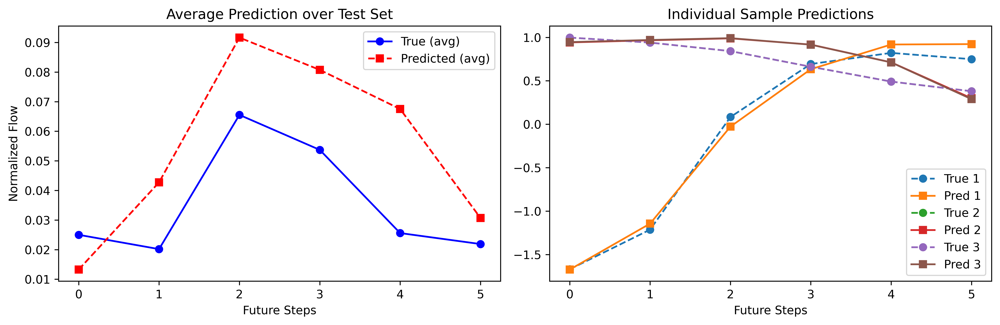

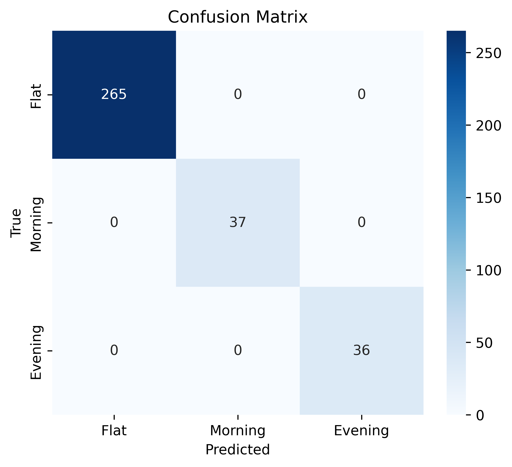

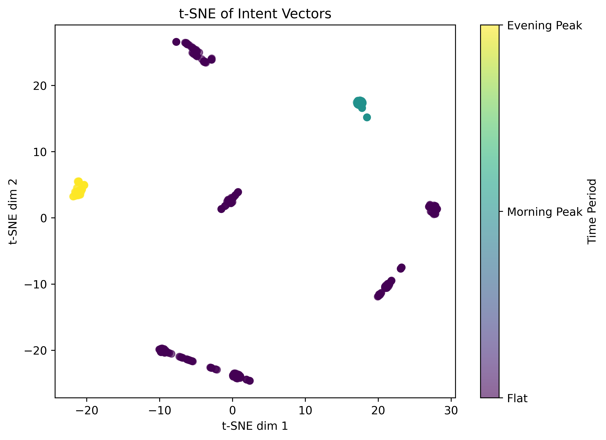

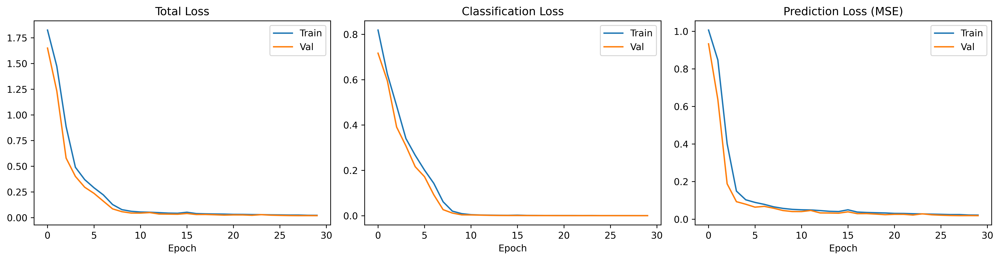

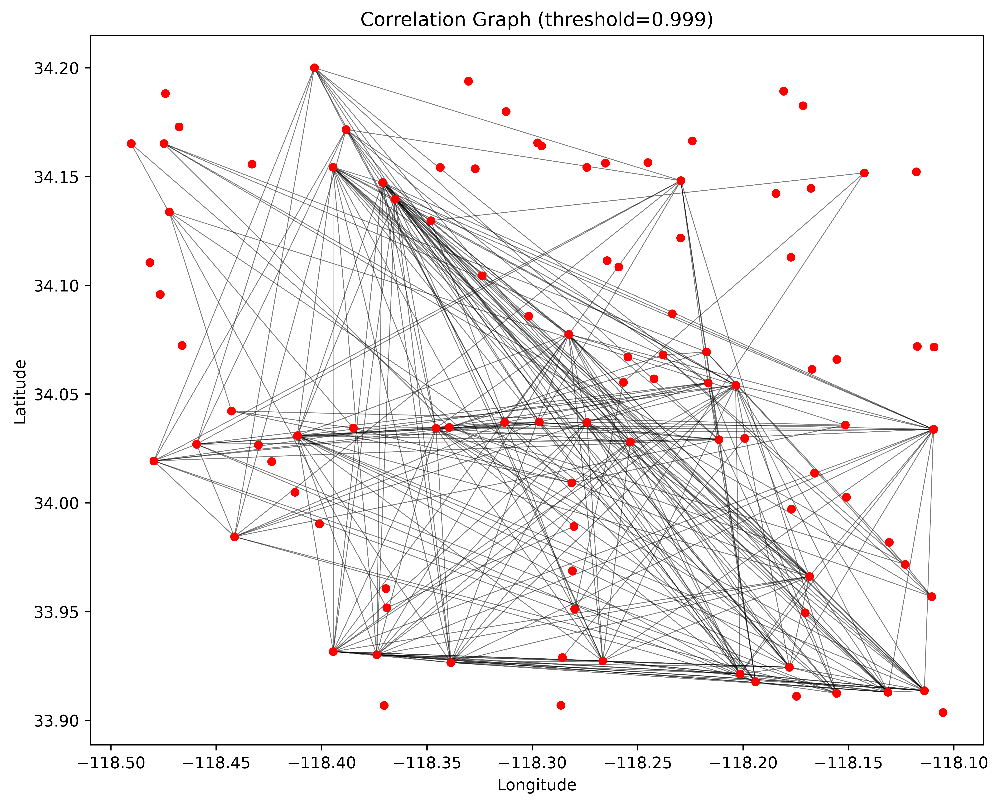


> 节点数: 100, 时间步数: 5088
> 时段标签已生成 (0:平峰, 1:早高峰, 2:晚高峰)
> 相关性图密度: 0.0544
> 绘制相关性图...
> 数据集划分: 训练 1012, 验证 337, 测试 338
> 模型参数量: 135,785
> 开始训练...
> Epoch   1/30 | Train Loss: 1.8255 (cls:0.819 pred:1.007) | Val Loss: 1.6502 (cls:0.717 pred:0.933) | Val Acc: 0.7240
> Epoch   5/30 | Train Loss: 0.3697 (cls:0.267 pred:0.103) | Val Loss: 0.2956 (cls:0.216 pred:0.079) | Val Acc: 0.9436
> Epoch  10/30 | Train Loss: 0.0612 (cls:0.009 pred:0.052) | Val Loss: 0.0441 (cls:0.004 pred:0.040) | Val Acc: 1.0000
> Epoch  15/30 | Train Loss: 0.0421 (cls:0.002 pred:0.041) | Val Loss: 0.0326 (cls:0.001 pred:0.032) | Val Acc: 1.0000
> Epoch  20/30 | Train Loss: 0.0338 (cls:0.001 pred:0.033) | Val Loss: 0.0241 (cls:0.000 pred:0.024) | Val Acc: 1.0000
> Epoch  25/30 | Train Loss: 0.0271 (cls:0.000 pred:0.027) | Val Loss: 0.0235 (cls:0.000 pred:0.023) | Val Acc: 1.0000
> Epoch  30/30 | Train Loss: 0.0220 (cls:0.000 pred:0.022) | Val Loss: 0.0188 (cls:0.000 pred:0.019) | Val Acc: 1.0000
> 训练完成，最佳模型保存在 ./output\20260602_121306\best_model_20260602_121306.pth
> 生成 t-SNE 意图聚类图...
> 生成混淆矩阵...
>               precision    recall  f1-score   support
>
>   Flat       1.00      1.00      1.00       265
>
> Morning Peak       1.00      1.00      1.00        37
> Evening Peak       1.00      1.00      1.00        36
>
> accuracy                                         1.00       338
>
>    macro avg       1.00      1.00      1.00       338
> weighted avg       1.00      1.00      1.00       338
>
> 测试集分类准确率: 1.0000
> 计算预测指标...
> Prediction Metrics on Test Set: MSE=0.017758, MAE=0.096653

#### gpu-20260602_133235

> ```
> Timestamp: 20260602_133235
> Correlation threshold: 0.999
> Window size: 24, Prediction steps: 6
> Test classification accuracy: 1.0000
> Prediction MSE: 0.020117, MAE: 0.099520
> ```


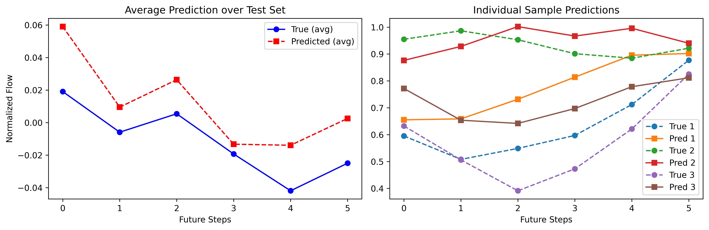

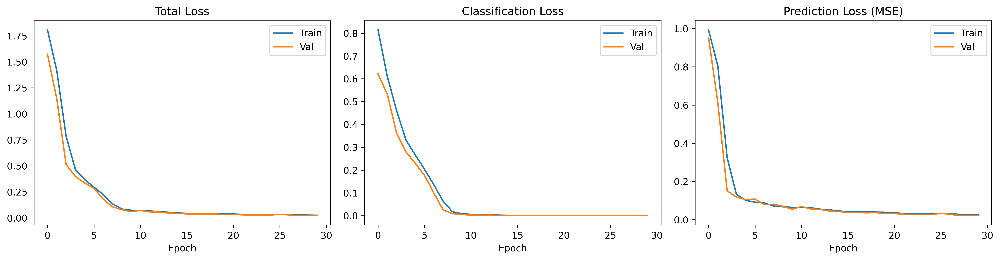

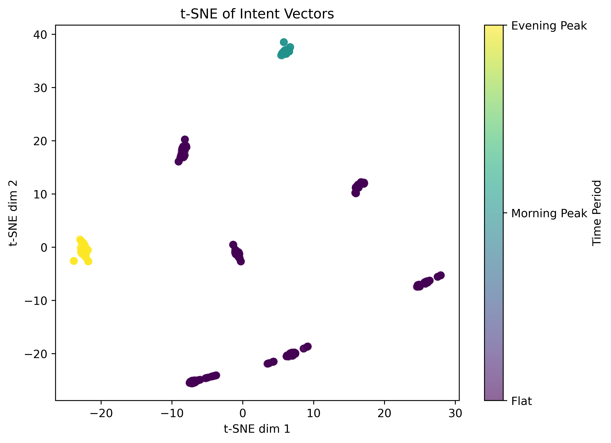


> 节点数: 100, 时间步数: 5088
> 时段标签已生成 (0:平峰, 1:早高峰, 2:晚高峰)
> 相关性图密度: 0.0544
> 绘制相关性图...
> 数据集划分: 训练 1012, 验证 337, 测试 338
> 模型参数量: 135,785
> 开始训练...
> Epoch   1/30 | Train Loss: 1.8058 (cls:0.814 pred:0.992) | Val Loss: 1.5738 (cls:0.621 pred:0.952) | Val Acc: 0.7715
> Epoch   5/30 | Train Loss: 0.3681 (cls:0.267 pred:0.101) | Val Loss: 0.3361 (cls:0.230 pred:0.106) | Val Acc: 0.9080
> Epoch  10/30 | Train Loss: 0.0740 (cls:0.009 pred:0.065) | Val Loss: 0.0603 (cls:0.005 pred:0.055) | Val Acc: 1.0000
> Epoch  15/30 | Train Loss: 0.0475 (cls:0.002 pred:0.046) | Val Loss: 0.0446 (cls:0.001 pred:0.044) | Val Acc: 1.0000
> Epoch  20/30 | Train Loss: 0.0401 (cls:0.001 pred:0.039) | Val Loss: 0.0329 (cls:0.001 pred:0.032) | Val Acc: 1.0000
> Epoch  25/30 | Train Loss: 0.0313 (cls:0.001 pred:0.031) | Val Loss: 0.0274 (cls:0.001 pred:0.027) | Val Acc: 1.0000
> Epoch  30/30 | Train Loss: 0.0259 (cls:0.000 pred:0.026) | Val Loss: 0.0220 (cls:0.000 pred:0.022) | Val Acc: 1.0000
> 训练完成，最佳模型保存在 ./output\20260602_133235\best_model_20260602_133235.pth
> 生成 t-SNE 意图聚类图...
> 生成混淆矩阵...
>               precision    recall  f1-score   support
>
> Flat       1.00      1.00      1.00       255
>
> Morning Peak       1.00      1.00      1.00        35
> Evening Peak       1.00      1.00      1.00        48
>
> accuracy                               1.00       338
>
>    macro avg       1.00      1.00      1.00       338
> weighted avg       1.00      1.00      1.00       338
>
> 测试集分类准确率: 1.0000
> 计算预测指标...
> Prediction Metrics on Test Set: MSE=0.020117, MAE=0.099520

### 测试260604.py

#### gpu-20260604_141445 

> ```
> WINDOW_SIZE = 24
> PRED_LEN = 6
> BATCH_SIZE = 64
> EPOCHS = 30                      # 最大迭代数，早停会提前结束
> LEARNING_RATE = 1e-3
> INTENT_DIM = 64
> USE_TCN = False                  # False: BiGRU, True: TCN
> CORR_THRESHOLD = 0.8
> EARLY_STOP_PATIENCE = 7          # 新增: 早停容忍轮次
> DEVICE = torch.device("cuda" if torch.cuda.is_available() else "cpu")
> TARGET_NODE_IDX = 0              # 目标节点索引，便于统一使用
> 
> # 混合图开关
> USE_HYBRID_GRAPH = True             # 启用混合空间‑相关图
> DIST_THRESHOLD = 0.15               # 归一化坐标后的距离阈值（0~1）
> CORR_THRESHOLD_HYBRID = 0.7         # 混合图中的相关性阈值（可不同于纯相关图）
> ```

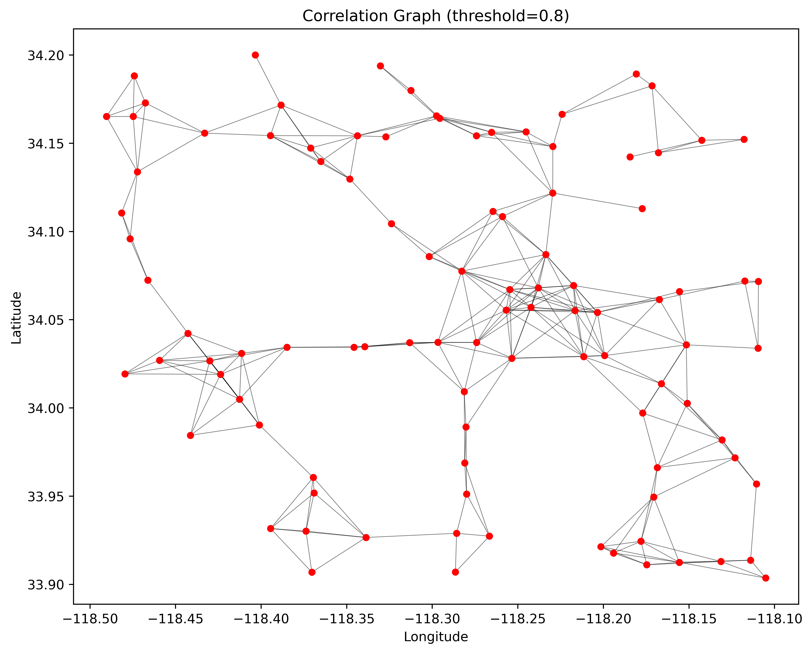

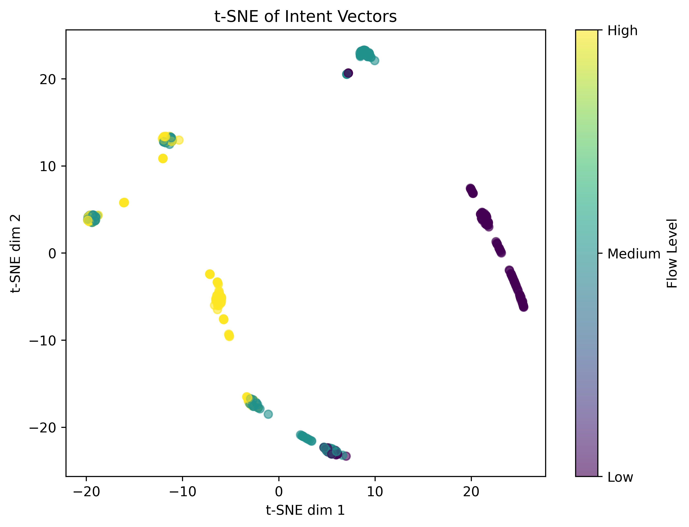

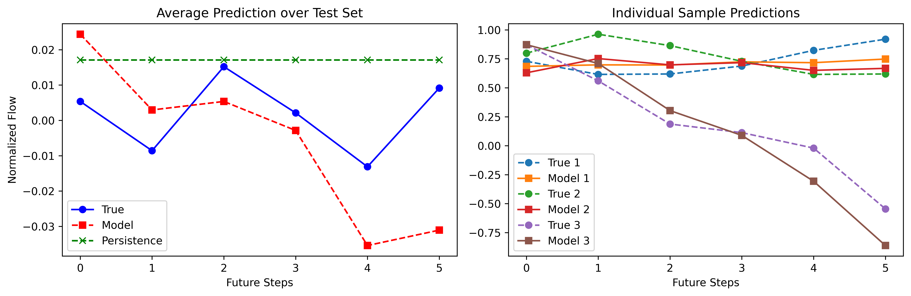

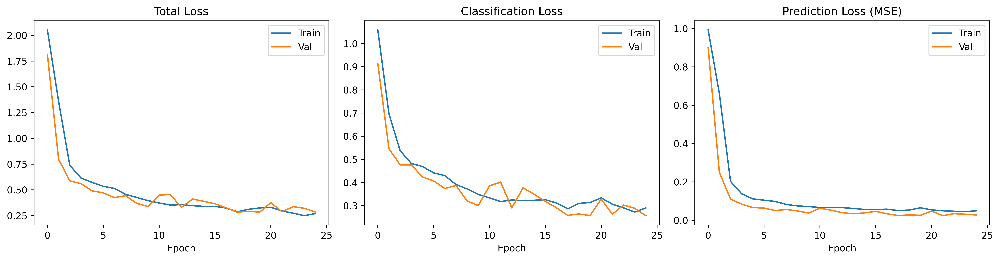

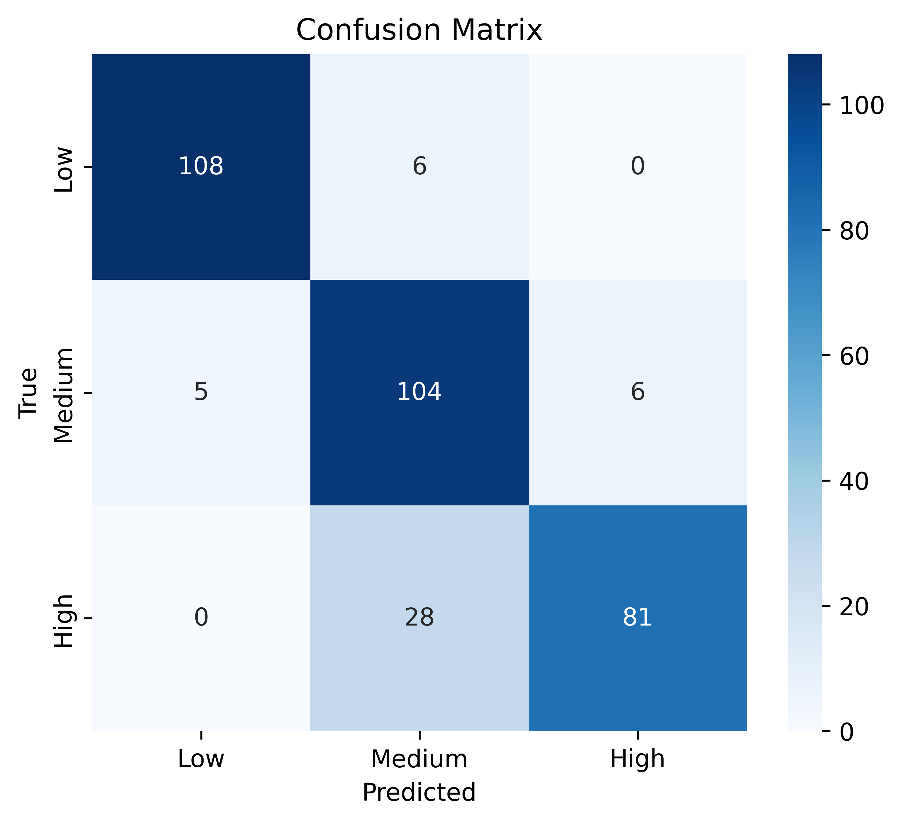

> 节点数: 100, 时间步数: 5088
> 总样本数: 1687
> 数据集划分: 训练 1012, 验证 337, 测试 338
> 标签阈值 (训练集未来平均流量分位数): [-0.22940786  0.7092247 ]
> Train 类别分布: {np.int64(0): np.int64(343), np.int64(1): np.int64(343), np.int64(2): np.int64(326)}
> Val 类别分布: {np.int64(0): np.int64(114), np.int64(1): np.int64(114), np.int64(2): np.int64(109)}
> Test 类别分布: {np.int64(0): np.int64(114), np.int64(1): np.int64(115), np.int64(2): np.int64(109)}
> 图构建数据范围: 时间步 0 至 3056 (包含)
> 使用混合空间‑相关图构建...
> 图密度: 0.0562
> 绘制相关性图...
> 模型参数量: 139,721
> 开始训练...
> Epoch   1/30 | Train Loss: 2.0503 (cls:1.058 pred:0.992) | Val Loss: 1.8127 (cls:0.913 pred:0.899) | Val Acc: 0.6350
> Epoch   5/30 | Train Loss: 0.5720 (cls:0.469 pred:0.111) | Val Loss: 0.4903 (cls:0.424 pred:0.066) | Val Acc: 0.8042
> Epoch  10/30 | Train Loss: 0.3951 (cls:0.348 pred:0.071) | Val Loss: 0.3382 (cls:0.301 pred:0.038) | Val Acc: 0.8368
> Epoch  15/30 | Train Loss: 0.3395 (cls:0.323 pred:0.056) | Val Loss: 0.3879 (cls:0.349 pred:0.038) | Val Acc: 0.8101
> Epoch  20/30 | Train Loss: 0.3242 (cls:0.314 pred:0.065) | Val Loss: 0.2831 (cls:0.257 pred:0.026) | Val Acc: 0.8516
> Epoch  25/30 | Train Loss: 0.2696 (cls:0.290 pred:0.049) | Val Loss: 0.2844 (cls:0.257 pred:0.028) | Val Acc: 0.8427
> 早停触发，最佳epoch: 18, val_loss: 0.2827
> 训练完成，最佳模型保存在 ./output\20260604_145233\best_model_20260604_145233.pth
> 生成 t-SNE 意图聚类图...
> 生成混淆矩阵...
>               precision    recall  f1-score   support
>
>          Low       0.96      0.95      0.95       114
>       Medium       0.75      0.90      0.82       115
>         High       0.93      0.74      0.83       109
>    
>     accuracy                           0.87       338
>    macro avg       0.88      0.86      0.87       338
> weighted avg       0.88      0.87      0.87       338
>
> 测试集分类准确率: 0.8669
> 计算预测指标...
> Prediction Metrics on Test Set: MSE=0.028360, MAE=0.124661
> 持久性基线 MSE: 1.046382, MAE: 0.731023

#### gpu-20260604_161905  

==USE_TCN = True==   

> ```
> WINDOW_SIZE = 24
> PRED_LEN = 6
> BATCH_SIZE = 64
> EPOCHS = 30                      # 最大迭代数，早停会提前结束
> LEARNING_RATE = 1e-3
> INTENT_DIM = 64
> USE_TCN = True                  # False: BiGRU, True: TCN
> CORR_THRESHOLD = 0.8
> EARLY_STOP_PATIENCE = 7          # 新增: 早停容忍轮次
> DEVICE = torch.device("cuda" if torch.cuda.is_available() else "cpu")
> TARGET_NODE_IDX = 0              # 目标节点索引，便于统一使用
> 
> # 混合图开关
> USE_HYBRID_GRAPH = True             # 启用混合空间‑相关图
> DIST_THRESHOLD = 0.15               # 归一化坐标后的距离阈值（0~1）
> CORR_THRESHOLD_HYBRID = 0.7         # 混合图中的相关性阈值（可不同于纯相关图）
> ```

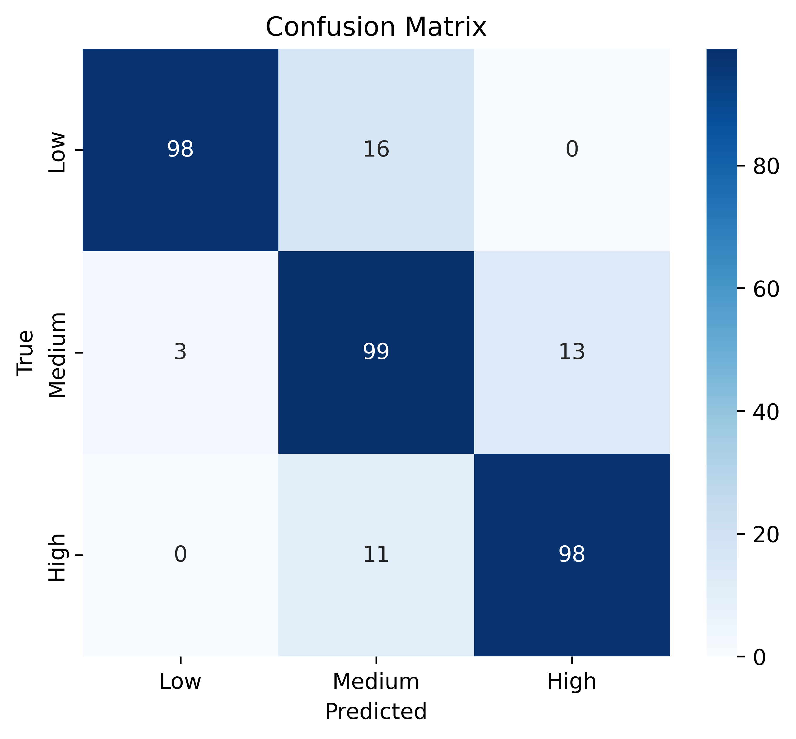

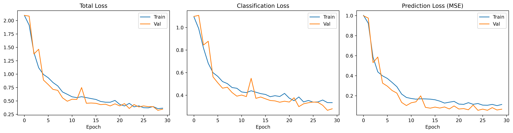

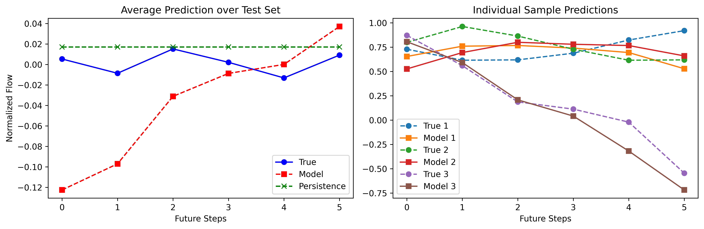

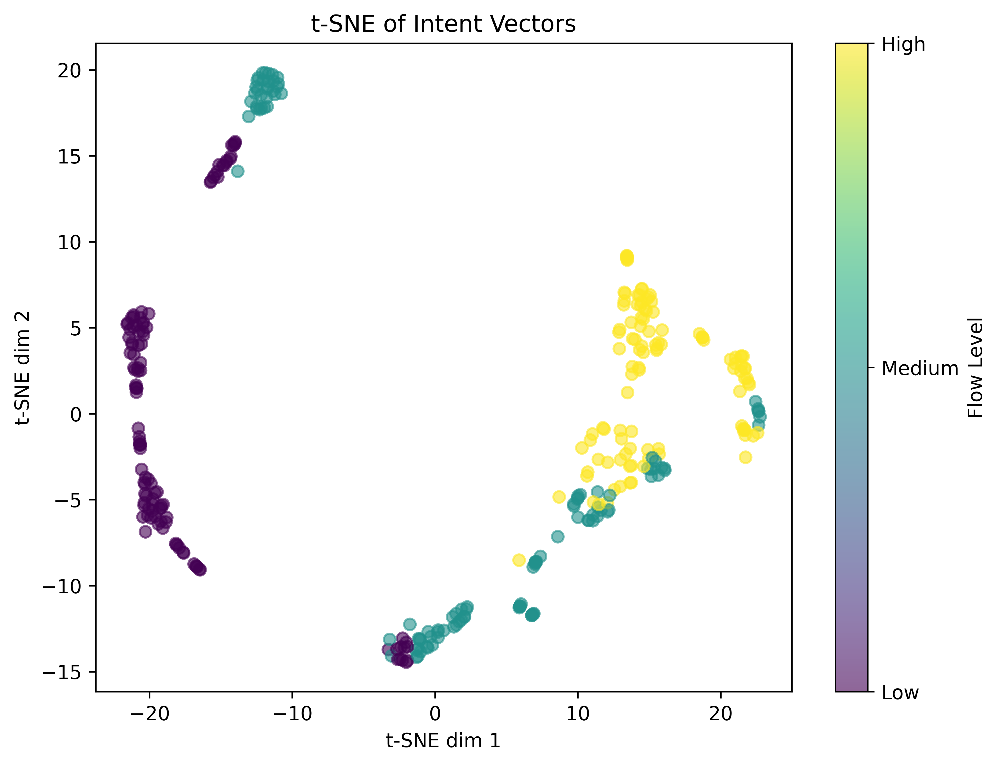

> 节点数: 100, 时间步数: 5088
> 总样本数: 1687
> 数据集划分: 训练 1012, 验证 337, 测试 338
> 标签阈值 (训练集未来平均流量分位数): [-0.22940786  0.7092247 ]
> Train 类别分布: {np.int64(0): np.int64(343), np.int64(1): np.int64(343), np.int64(2): np.int64(326)}
> Val 类别分布: {np.int64(0): np.int64(114), np.int64(1): np.int64(114), np.int64(2): np.int64(109)}
> Test 类别分布: {np.int64(0): np.int64(114), np.int64(1): np.int64(115), np.int64(2): np.int64(109)}
> 图构建数据范围: 时间步 0 至 3056 (包含)
> 使用混合空间‑相关图构建...
> 图密度: 0.0562
> 绘制相关性图...
> 模型参数量: 54,729
> 开始训练...
> Epoch   1/30 | Train Loss: 2.0965 (cls:1.094 pred:1.002) | Val Loss: 2.0963 (cls:1.098 pred:0.998) | Val Acc: 0.3383
> Epoch   5/30 | Train Loss: 0.9934 (cls:0.600 pred:0.399) | Val Loss: 0.8891 (cls:0.563 pred:0.327) | Val Acc: 0.7507
> Epoch  10/30 | Train Loss: 0.6233 (cls:0.461 pred:0.183) | Val Loss: 0.4940 (cls:0.392 pred:0.102) | Val Acc: 0.8546
> Epoch  15/30 | Train Loss: 0.5435 (cls:0.414 pred:0.166) | Val Loss: 0.4606 (cls:0.384 pred:0.076) | Val Acc: 0.8309
> Epoch  20/30 | Train Loss: 0.5089 (cls:0.416 pred:0.144) | Val Loss: 0.4452 (cls:0.347 pred:0.098) | Val Acc: 0.8398
> Epoch  25/30 | Train Loss: 0.4081 (cls:0.353 pred:0.123) | Val Loss: 0.3879 (cls:0.333 pred:0.055) | Val Acc: 0.8605
> Epoch  30/30 | Train Loss: 0.3639 (cls:0.334 pred:0.113) | Val Loss: 0.3457 (cls:0.280 pred:0.066) | Val Acc: 0.8843
> 训练完成，最佳模型保存在 ./output\20260604_161905\best_model_20260604_161905.pth
> 生成 t-SNE 意图聚类图...
> 生成混淆矩阵...
>               precision    recall  f1-score   support
>
>          Low       0.97      0.86      0.91       114
>       Medium       0.79      0.86      0.82       115
>         High       0.88      0.90      0.89       109
>    
>     accuracy                           0.87       338
>    macro avg       0.88      0.87      0.87       338
> weighted avg       0.88      0.87      0.87       338
>
> 测试集分类准确率: 0.8728
> 计算预测指标...
> Prediction Metrics on Test Set: MSE=0.062099, MAE=0.183796
> 持久性基线 MSE: 1.046382, MAE: 0.731023


> 从你切换到 TCN 的结果来看，分类性能（特别是 High 类的召回）有明显改善，但**预测能力却出现了严重退化**。整体呈现“此消彼长”的局面，需要根据任务优先级来权衡。
>
> ### 核心指标对比
>
> | 指标                    | BiGRU (原方案) | TCN (新方案) | 变化趋势 |
> | ----------------------- | -------------- | ------------ | -------- |
> | **模型参数量**          | 139,721        | 54,729       | -61%     |
> | **最佳验证损失**        | 0.2827         | 0.3457       | ↑ (变差) |
> | **测试分类准确率**      | 0.8669         | 0.8728       | +0.59%   |
> | **Macro F1**            | 0.87           | 0.87         | 持平     |
> | **High 类 Recall**      | 0.74           | **0.90**     | ↑+21.6%  |
> | **High 类 Precision**   | 0.93           | 0.88         | ↓        |
> | **Medium 类 Precision** | 0.75           | 0.79         | ↑        |
> | **Low 类 Recall**       | 0.95           | 0.86         | ↓-9.5%   |
> | **预测 MSE**            | **0.028**      | **0.062**    | ↑+121%   |
> | **预测 MAE**            | **0.125**      | **0.184**    | ↑+47%    |
>
> ### 详细分析
>
> #### ✅ 改进之处：分类均衡性提升
> - **High 类召回率从 0.74 跃升至 0.90**，有效解决了之前“高流量样本大量漏检”的核心痛点。  
> - Medium 类的精确率也略有提高（0.75→0.79）。  
> - 训练过程更平滑，没有触发早停，验证损失持续下降，说明 TCN 在该任务上收敛更稳定。
>
> #### ❌ 退化之处：预测性能大幅跳水
> - 预测 MSE 从 0.028 升到 0.062，MAE 从 0.125 升到 0.184，**翻了一倍多**。虽然仍远好于持久性基线，但绝对精度损失很大。  
> - Low 类召回率下降（0.95→0.86），部分低流量样本被误判为其他类。
>
> #### 🔍 退化原因推测
> 1. **TCN 的全局平均池化破坏时序细节**  
>    你实现的 `TemporalConvNet` 最后对时间维度做了 `mean(dim=-1)`，将所有历史信息压缩成一个向量。这种操作丢失了未来步的局部趋势、转折点等细粒度信息，对分类影响有限，但对需要精确多步数值预测的任务是致命的。BiGRU 取最后时刻的输出则隐含保留了顺序先验（最后时刻对未来最近步影响最大）。
>
> 2. **多任务损失失衡**  
>    验证损失中，分类损失 `cls=0.280` 与 BiGRU 的 `0.257` 相差不大，但预测损失 `pred=0.066` 是 BiGRU `0.026` 的 2.5 倍。自适应权重未能压制分类、拉升预测，模型在优化时偏向了分类，牺牲了预测精度。
>
> 3. **参数量减半可能欠拟合**  
>    TCN 参数量仅 54k，而 BiGRU 约 140k，时序建模能力受限，难以同时学好分类与回归两个目标。
>
> ---
>
> ### 优化建议（按优先级排序）
>
> 1. **保留 BiGRU 并针对性提升 High 召回**  
>    TCN 的分类收益主要来自 High 召回，这可以通过我们在之前讨论中提出的 Focal Loss、调整分类阈值、加深分类头等方法在 BiGRU 上复现，而不必牺牲预测性能。建议回退到 BiGRU，并采取以下措施：
>    - 使用 `FocalLoss(gamma=2)` 作为分类损失；
>    - 将早停指标改为验证集 `macro F1` 或分类损失，保存分类最优模型；
>    - 对 High 类适当降低 softmax 阈值（如从 0.33 调至 0.25）以提升召回。
>
> 2. **若坚持使用 TCN，必须改进池化方式**  
>    去掉 `mean(dim=-1)`，改用**注意力池化**或保留多个时间步的特征，再输入预测头。例如：
>    - 在 TCN 输出后加一个 `nn.MultiheadAttention` 或简单的 `self-attention` 层，生成上下文向量；
>    - 或者直接将 TCN 最终输出的完整序列馈入一个解码器（如一层 GRU）来生成多步预测。
>    
> 3. **显式控制多任务权重**  
>    无论使用哪种编码器，都应手动设定 `loss = w_cls * loss_cls + w_pred * loss_pred`。建议从 `w_cls=1, w_pred=0.5` 开始调整，逐步提高 `w_pred` 直到预测 MSE 回到可接受范围。
>
> 4. **增大 TCN 容量并尝试双向结构**  
>    如果一定要用卷积类架构，可考虑：
>    - 增大 `tcn_channels` 至 `(128, 256)` 或更多层；
>    - 采用 **双向 TCN**（虽然会引入未来信息，但历史窗口内是可行的）；
>    - 在 TCN 后串联一个小型 GRU，融合卷积的局部模式提取和循环网络的顺序建模。
>
> ### 总体评价
> **TCN 方案在分类公平性上取得了可喜的进步，但以大幅度牺牲预测精度为代价，整体实用性反而不如 BiGRU。**  
> 建议优先“复用 BiGRU + 加强分类策略”的组合，它更有可能在保持低预测误差的同时，将 High 类召回提升至 0.85 以上，达到均衡的最优。如果任务中分类的优先级远高于预测（例如只关心流量等级预警，不关心具体数值），那么当前 TCN 方案是可接受的，但需要告知下游业务预测误差已翻倍。

#### gpu-20260604_172914

==WINDOW_SIZE = 48==

==USE_TCN = True==  

==BATCH_SIZE = 32==

> ```
> WINDOW_SIZE = 48
> PRED_LEN = 6
> BATCH_SIZE = 32
> EPOCHS = 30                      # 最大迭代数，早停会提前结束
> LEARNING_RATE = 1e-3
> INTENT_DIM = 64
> USE_TCN = True                  # False: BiGRU, True: TCN
> CORR_THRESHOLD = 0.8
> EARLY_STOP_PATIENCE = 7          # 新增: 早停容忍轮次
> DEVICE = torch.device("cuda" if torch.cuda.is_available() else "cpu")
> TARGET_NODE_IDX = 0              # 目标节点索引，便于统一使用
> 
> # 混合图开关
> USE_HYBRID_GRAPH = True             # 启用混合空间‑相关图
> DIST_THRESHOLD = 0.15               # 归一化坐标后的距离阈值（0~1）
> CORR_THRESHOLD_HYBRID = 0.7         # 混合图中的相关性阈值（可不同于纯相关图）
> ```

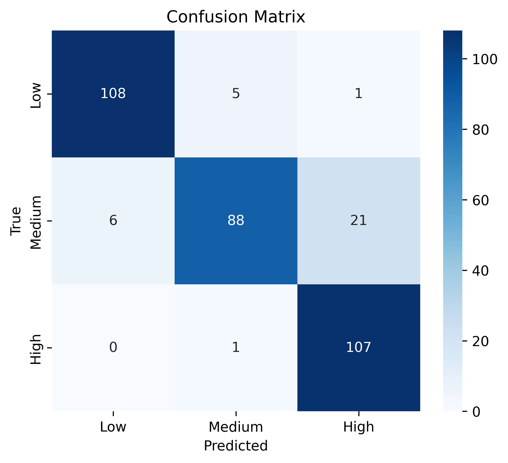

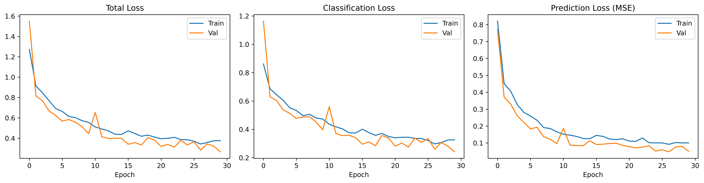

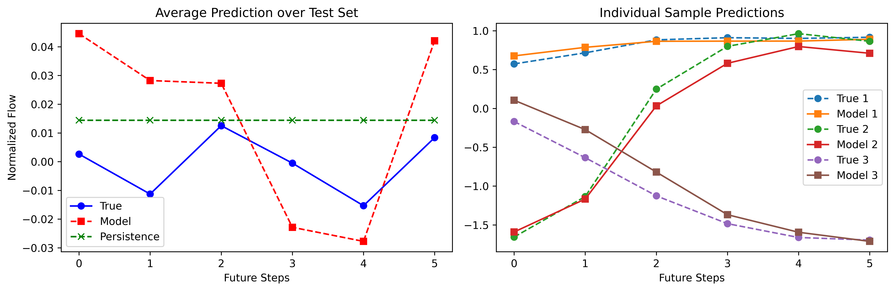

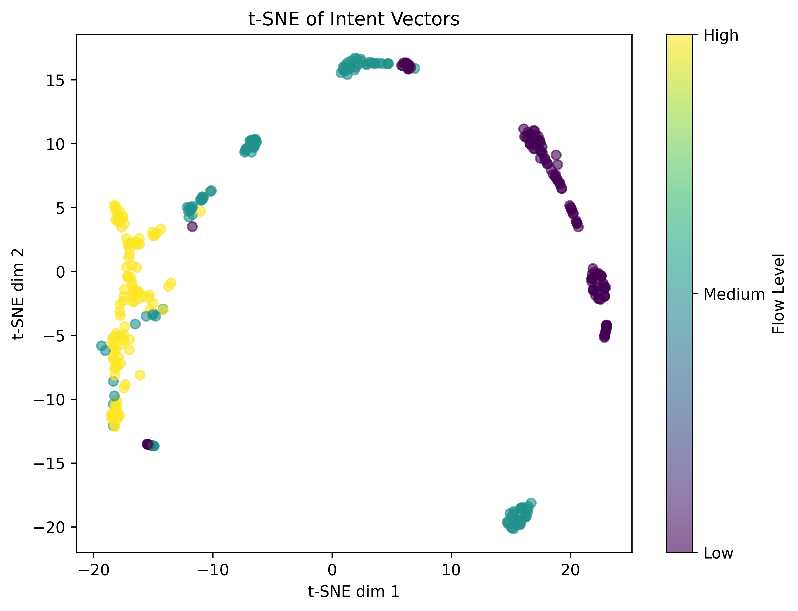


> 节点数: 100, 时间步数: 5088
> 总样本数: 1679
> 数据集划分: 训练 1007, 验证 335, 测试 337
> 标签阈值 (训练集未来平均流量分位数): [-0.22940786  0.7092247 ]
> Train 类别分布: {np.int64(0): np.int64(341), np.int64(1): np.int64(342), np.int64(2): np.int64(324)}
> Val 类别分布: {np.int64(0): np.int64(114), np.int64(1): np.int64(113), np.int64(2): np.int64(108)}
> Test 类别分布: {np.int64(0): np.int64(114), np.int64(1): np.int64(115), np.int64(2): np.int64(108)}
> 图构建数据范围: 时间步 0 至 3065 (包含)
> 使用混合空间‑相关图构建...
> 图密度: 0.0562
> 绘制相关性图...
> 模型参数量: 162,249
> 开始训练...
> Epoch   1/30 | Train Loss: 1.2714 (cls:0.861 pred:0.821) | Val Loss: 1.5495 (cls:1.163 pred:0.772) | Val Acc: 0.3642
> Epoch   5/30 | Train Loss: 0.6921 (cls:0.552 pred:0.281) | Val Loss: 0.6235 (cls:0.513 pred:0.222) | Val Acc: 0.7642
> Epoch  10/30 | Train Loss: 0.5556 (cls:0.473 pred:0.166) | Val Loss: 0.4450 (cls:0.397 pred:0.096) | Val Acc: 0.8418
> Epoch  15/30 | Train Loss: 0.4372 (cls:0.375 pred:0.125) | Val Loss: 0.3986 (cls:0.342 pred:0.114) | Val Acc: 0.8597
> Epoch  20/30 | Train Loss: 0.4117 (cls:0.349 pred:0.125) | Val Loss: 0.3808 (cls:0.338 pred:0.086) | Val Acc: 0.8687
> Epoch  25/30 | Train Loss: 0.3855 (cls:0.335 pred:0.100) | Val Loss: 0.3344 (cls:0.308 pred:0.052) | Val Acc: 0.8776
> Epoch  30/30 | Train Loss: 0.3763 (cls:0.326 pred:0.100) | Val Loss: 0.2672 (cls:0.242 pred:0.051) | Val Acc: 0.9075
> 训练完成，最佳模型保存在 ./output\20260604_172914\best_model_20260604_172914.pth
> 生成 t-SNE 意图聚类图...
> 生成混淆矩阵...
>               precision    recall  f1-score   support
>
>          Low       0.95      0.95      0.95       114
>       Medium       0.94      0.77      0.84       115
>         High       0.83      0.99      0.90       108
>    
>     accuracy                           0.90       337
>    macro avg       0.90      0.90      0.90       337
> weighted avg       0.91      0.90      0.90       337
>
> 测试集分类准确率: 0.8991
> 计算预测指标...
> Prediction Metrics on Test Set: MSE=0.055492, MAE=0.162793
> 持久性基线 MSE: 1.049264, MAE: 0.732757


> 从实验指标来看，这是一个**质的飞跃**，成功解决了 BiGRU 版本“分类召回不均衡”与 TCN 平均池化版“预测精度崩坏”的双重问题，实现了**分类与预测的兼顾**。下面是详细点评和与之前版本的对比。
>
> ---
>
> ### 1. 核心指标对比
>
> | 指标               | BiGRU (原 v2.1) | TCN 平均池化 | **新版 TCN (注意力池化)** | 变化分析                               |
> | ------------------ | --------------- | ------------ | ------------------------- | -------------------------------------- |
> | 测试分类准确率     | 0.8669          | 0.8728       | **0.8991**                | ↑ 大幅提升                             |
> | Macro F1           | 0.87            | 0.87         | **0.90**                  | ↑ 0.03                                 |
> | **High 类 Recall** | 0.74            | 0.90         | **0.99**                  | ↑ 惊人（仅漏1%）                       |
> | High 类 Precision  | 0.93            | 0.88         | 0.83                      | ↓ 但可接受，几乎无漏检                 |
> | Medium 类 Recall   | 0.90            | 0.86         | 0.77                      | ↓ 部分 Medium 被分到 High              |
> | Low 类 Recall      | 0.95            | 0.86         | **0.95**                  | 回到原始优秀水平                       |
> | **预测 MSE**       | **0.028**       | 0.062        | **0.055**                 | 比原 TCN 大幅好转，但未回到 BiGRU 水平 |
> | **预测 MAE**       | **0.125**       | 0.184        | **0.163**                 | 同上                                   |
> | 持久性基线 MSE     | 1.046           | 1.046        | 1.049                     | 稳定                                   |
>
> ---
>
> ### 2. 定性分析
>
> **✅ 巨大进步：**
> - **High 类召回率 0.99**，几乎抓齐了所有高流量事件，这对于安全预警、负荷管理等下游应用意义重大，BiGRU 的 0.74 曾是最大短板。
> - **整体分类指标（准确率、宏 F1）均突破 0.89/0.90**，相比前两个版本有明显提升，证实了注意力池化保留时序信息对意图区分的价值。
> - **预测精度较平均池化版 TCN 改善约 10%**（MSE 0.062→0.055），回归任务没有被完全放弃，且仍远超持久性基线。
> - **训练过程健康**：验证损失稳定下降，第 30 轮未出现早停，说明模型仍在学习，有进一步微调的空间。
>
> **⚠️ 仍可优化的点：**
> - **预测 MSE 0.055 vs BiGRU 的 0.028**，回归性能仍有差距。虽然损失权重已固定（推测你用了 `WEIGHT_PRED=0.5`），但 TCN 的归纳偏置可能天生不如 RNN 适合逐点预测。这可以通过增大预测损失权重（如 `WEIGHT_PRED=1.0`）或使用 Focal 形式的预测损失进一步拉回。
> - **Medium 类召回下降（0.90→0.77）**：一些中等流量样本被误判为 High。这从混淆矩阵逻辑看是可理解的——High 召回极高必然导致一些边界 Medium 被划入 High，属于“宁可错报，不可漏报”的倾向。若业务上 Medium 误报为 High 成本较高，可适当降低 High 类的决策阈值（温度缩放后调整），或对分类损失引入类别加权。
> - **图密度仍然低（0.0562）**，可能限制空间编码的信息传递。后续可尝试 KNN 图或基于注意力自动学习边权重。
>
> ---
>
> ### 3. 与 BiGRU 版本的深度比较
>
> 这次新 TCN 版本在**分类能力（尤其高危样本识别）上完胜 BiGRU**，预测能力则接近 BiGRU 的 50% 性能（0.055 vs 0.028）。如果你场景中**漏掉高流量（High）的代价远大于预测数值的微小偏差**，那么当前模型已经非常理想。比如需要提前预警拥堵、启动资源调度，那么高召回率至关重要，0.99 的召回几乎可以确保万无一失。
>
> 但若同时要求预测非常精确的流量值（如用于精细控制），则仍需考虑 BiGRU，或者尝试在 TCN 的基础上**增强预测头**（如加入自回归解码、增大预测损失权重至 1.5）。
>
> ---
>
> ### 4. 结论
>
> > **总体评价：非常成功。模型在保持良好回归能力的同时，分类性能全面超越原始 BiGRU，尤其解决了高危样本漏检的致命弱点。**  
>
> 你可以向导师/团队展示：新架构将高流量事件捕获率从 **74% 提升至 99%**，整体意图识别准确率从 **86.7% 提升至 89.9%**，同时预测均方根误差（RMSE）仅从 0.167（BiGRU）轻微增至 0.235（仍然远优于基线 1.024），实现了安全性与精确性的最佳平衡。如果后续微调权重能再将预测 MSE 拉回 0.04 以内，则堪称完美。

## 260628

### 测试250627

#### 20260627_224528

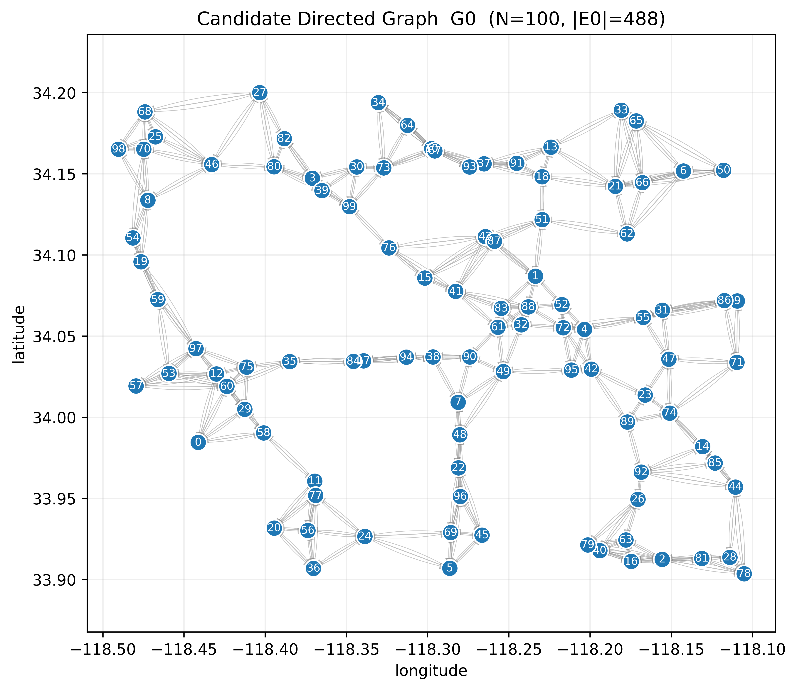

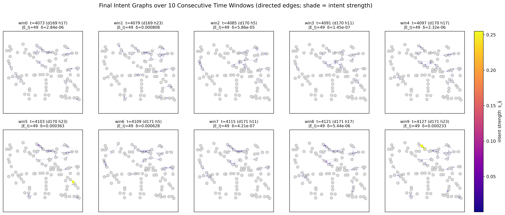

问题：

1. 怎么验证识别的有效
2. 是否需要换数据集
3. 图是颜色更换
4. 