## 260603

### 测试260601.py

#### cpu-20260602_121306

> Timestamp: 20260602_121306
> Correlation threshold: 0.999
> Window size: 24, Prediction steps: 6
> Test classification accuracy: 1.0000
> Prediction MSE: 0.017758, MAE: 0.096653


> 节点数: 100, 时间步数: 5088
> 时段标签已生成 (0:平峰, 1:早高峰, 2:晚高峰)
> 相关性图密度: 0.0544
> 绘制相关性图...
> 数据集划分: 训练 1012, 验证 337, 测试 338
> 模型参数量: 135,785
> 开始训练...
> Epoch   1/30 | Train Loss: 1.8255 (cls:0.819 pred:1.007) | Val Loss: 1.6502 (cls:0.717 pred:0.933) | Val Acc: 0.7240
> Epoch   5/30 | Train Loss: 0.3697 (cls:0.267 pred:0.103) | Val Loss: 0.2956 (cls:0.216 pred:0.079) | Val Acc: 0.9436
> Epoch  10/30 | Train Loss: 0.0612 (cls:0.009 pred:0.052) | Val Loss: 0.0441 (cls:0.004 pred:0.040) | Val Acc: 1.0000
> Epoch  15/30 | Train Loss: 0.0421 (cls:0.002 pred:0.041) | Val Loss: 0.0326 (cls:0.001 pred:0.032) | Val Acc: 1.0000
> Epoch  20/30 | Train Loss: 0.0338 (cls:0.001 pred:0.033) | Val Loss: 0.0241 (cls:0.000 pred:0.024) | Val Acc: 1.0000
> Epoch  25/30 | Train Loss: 0.0271 (cls:0.000 pred:0.027) | Val Loss: 0.0235 (cls:0.000 pred:0.023) | Val Acc: 1.0000
> Epoch  30/30 | Train Loss: 0.0220 (cls:0.000 pred:0.022) | Val Loss: 0.0188 (cls:0.000 pred:0.019) | Val Acc: 1.0000
> 训练完成，最佳模型保存在 ./output\20260602_121306\best_model_20260602_121306.pth
> 生成 t-SNE 意图聚类图...
> 生成混淆矩阵...
>               precision    recall  f1-score   support
>
>   Flat       1.00      1.00      1.00       265
>
> Morning Peak       1.00      1.00      1.00        37
> Evening Peak       1.00      1.00      1.00        36
>
> accuracy                                         1.00       338
>
>    macro avg       1.00      1.00      1.00       338
> weighted avg       1.00      1.00      1.00       338
>
> 测试集分类准确率: 1.0000
> 计算预测指标...
> Prediction Metrics on Test Set: MSE=0.017758, MAE=0.096653

#### gpu-20260602_133235

> ```
> Timestamp: 20260602_133235
> Correlation threshold: 0.999
> Window size: 24, Prediction steps: 6
> Test classification accuracy: 1.0000
> Prediction MSE: 0.020117, MAE: 0.099520
> ```


> 节点数: 100, 时间步数: 5088
> 时段标签已生成 (0:平峰, 1:早高峰, 2:晚高峰)
> 相关性图密度: 0.0544
> 绘制相关性图...
> 数据集划分: 训练 1012, 验证 337, 测试 338
> 模型参数量: 135,785
> 开始训练...
> Epoch   1/30 | Train Loss: 1.8058 (cls:0.814 pred:0.992) | Val Loss: 1.5738 (cls:0.621 pred:0.952) | Val Acc: 0.7715
> Epoch   5/30 | Train Loss: 0.3681 (cls:0.267 pred:0.101) | Val Loss: 0.3361 (cls:0.230 pred:0.106) | Val Acc: 0.9080
> Epoch  10/30 | Train Loss: 0.0740 (cls:0.009 pred:0.065) | Val Loss: 0.0603 (cls:0.005 pred:0.055) | Val Acc: 1.0000
> Epoch  15/30 | Train Loss: 0.0475 (cls:0.002 pred:0.046) | Val Loss: 0.0446 (cls:0.001 pred:0.044) | Val Acc: 1.0000
> Epoch  20/30 | Train Loss: 0.0401 (cls:0.001 pred:0.039) | Val Loss: 0.0329 (cls:0.001 pred:0.032) | Val Acc: 1.0000
> Epoch  25/30 | Train Loss: 0.0313 (cls:0.001 pred:0.031) | Val Loss: 0.0274 (cls:0.001 pred:0.027) | Val Acc: 1.0000
> Epoch  30/30 | Train Loss: 0.0259 (cls:0.000 pred:0.026) | Val Loss: 0.0220 (cls:0.000 pred:0.022) | Val Acc: 1.0000
> 训练完成，最佳模型保存在 ./output\20260602_133235\best_model_20260602_133235.pth
> 生成 t-SNE 意图聚类图...
> 生成混淆矩阵...
>               precision    recall  f1-score   support
>
> Flat       1.00      1.00      1.00       255
>
> Morning Peak       1.00      1.00      1.00        35
> Evening Peak       1.00      1.00      1.00        48
>
> accuracy                               1.00       338
>
>    macro avg       1.00      1.00      1.00       338
> weighted avg       1.00      1.00      1.00       338
>
> 测试集分类准确率: 1.0000
> 计算预测指标...
> Prediction Metrics on Test Set: MSE=0.020117, MAE=0.099520

### 测试260604.py

#### gpu-20260604_141445 

> ```
> WINDOW_SIZE = 24
> PRED_LEN = 6
> BATCH_SIZE = 64
> EPOCHS = 30                      # 最大迭代数，早停会提前结束
> LEARNING_RATE = 1e-3
> INTENT_DIM = 64
> USE_TCN = False                  # False: BiGRU, True: TCN
> CORR_THRESHOLD = 0.8
> EARLY_STOP_PATIENCE = 7          # 新增: 早停容忍轮次
> DEVICE = torch.device("cuda" if torch.cuda.is_available() else "cpu")
> TARGET_NODE_IDX = 0              # 目标节点索引，便于统一使用
> 
> # 混合图开关
> USE_HYBRID_GRAPH = True             # 启用混合空间‑相关图
> DIST_THRESHOLD = 0.15               # 归一化坐标后的距离阈值（0~1）
> CORR_THRESHOLD_HYBRID = 0.7         # 混合图中的相关性阈值（可不同于纯相关图）
> ```


> 节点数: 100, 时间步数: 5088
> 总样本数: 1687
> 数据集划分: 训练 1012, 验证 337, 测试 338
> 标签阈值 (训练集未来平均流量分位数): [-0.22940786  0.7092247 ]
> Train 类别分布: {np.int64(0): np.int64(343), np.int64(1): np.int64(343), np.int64(2): np.int64(326)}
> Val 类别分布: {np.int64(0): np.int64(114), np.int64(1): np.int64(114), np.int64(2): np.int64(109)}
> Test 类别分布: {np.int64(0): np.int64(114), np.int64(1): np.int64(115), np.int64(2): np.int64(109)}
> 图构建数据范围: 时间步 0 至 3056 (包含)
> 使用混合空间‑相关图构建...
> 图密度: 0.0562
> 绘制相关性图...
> 模型参数量: 139,721
> 开始训练...
> Epoch   1/30 | Train Loss: 2.0503 (cls:1.058 pred:0.992) | Val Loss: 1.8127 (cls:0.913 pred:0.899) | Val Acc: 0.6350
> Epoch   5/30 | Train Loss: 0.5720 (cls:0.469 pred:0.111) | Val Loss: 0.4903 (cls:0.424 pred:0.066) | Val Acc: 0.8042
> Epoch  10/30 | Train Loss: 0.3951 (cls:0.348 pred:0.071) | Val Loss: 0.3382 (cls:0.301 pred:0.038) | Val Acc: 0.8368
> Epoch  15/30 | Train Loss: 0.3395 (cls:0.323 pred:0.056) | Val Loss: 0.3879 (cls:0.349 pred:0.038) | Val Acc: 0.8101
> Epoch  20/30 | Train Loss: 0.3242 (cls:0.314 pred:0.065) | Val Loss: 0.2831 (cls:0.257 pred:0.026) | Val Acc: 0.8516
> Epoch  25/30 | Train Loss: 0.2696 (cls:0.290 pred:0.049) | Val Loss: 0.2844 (cls:0.257 pred:0.028) | Val Acc: 0.8427
> 早停触发，最佳epoch: 18, val_loss: 0.2827
> 训练完成，最佳模型保存在 ./output\20260604_145233\best_model_20260604_145233.pth
> 生成 t-SNE 意图聚类图...
> 生成混淆矩阵...
>               precision    recall  f1-score   support
>
>          Low       0.96      0.95      0.95       114
>       Medium       0.75      0.90      0.82       115
>         High       0.93      0.74      0.83       109
>    
>     accuracy                           0.87       338
>    macro avg       0.88      0.86      0.87       338
> weighted avg       0.88      0.87      0.87       338
>
> 测试集分类准确率: 0.8669
> 计算预测指标...
> Prediction Metrics on Test Set: MSE=0.028360, MAE=0.124661
> 持久性基线 MSE: 1.046382, MAE: 0.731023

#### gpu-20260604_161905  

==USE_TCN = True==   

> ```
> WINDOW_SIZE = 24
> PRED_LEN = 6
> BATCH_SIZE = 64
> EPOCHS = 30                      # 最大迭代数，早停会提前结束
> LEARNING_RATE = 1e-3
> INTENT_DIM = 64
> USE_TCN = True                  # False: BiGRU, True: TCN
> CORR_THRESHOLD = 0.8
> EARLY_STOP_PATIENCE = 7          # 新增: 早停容忍轮次
> DEVICE = torch.device("cuda" if torch.cuda.is_available() else "cpu")
> TARGET_NODE_IDX = 0              # 目标节点索引，便于统一使用
> 
> # 混合图开关
> USE_HYBRID_GRAPH = True             # 启用混合空间‑相关图
> DIST_THRESHOLD = 0.15               # 归一化坐标后的距离阈值（0~1）
> CORR_THRESHOLD_HYBRID = 0.7         # 混合图中的相关性阈值（可不同于纯相关图）
> ```


> 节点数: 100, 时间步数: 5088
> 总样本数: 1687
> 数据集划分: 训练 1012, 验证 337, 测试 338
> 标签阈值 (训练集未来平均流量分位数): [-0.22940786  0.7092247 ]
> Train 类别分布: {np.int64(0): np.int64(343), np.int64(1): np.int64(343), np.int64(2): np.int64(326)}
> Val 类别分布: {np.int64(0): np.int64(114), np.int64(1): np.int64(114), np.int64(2): np.int64(109)}
> Test 类别分布: {np.int64(0): np.int64(114), np.int64(1): np.int64(115), np.int64(2): np.int64(109)}
> 图构建数据范围: 时间步 0 至 3056 (包含)
> 使用混合空间‑相关图构建...
> 图密度: 0.0562
> 绘制相关性图...
> 模型参数量: 54,729
> 开始训练...
> Epoch   1/30 | Train Loss: 2.0965 (cls:1.094 pred:1.002) | Val Loss: 2.0963 (cls:1.098 pred:0.998) | Val Acc: 0.3383
> Epoch   5/30 | Train Loss: 0.9934 (cls:0.600 pred:0.399) | Val Loss: 0.8891 (cls:0.563 pred:0.327) | Val Acc: 0.7507
> Epoch  10/30 | Train Loss: 0.6233 (cls:0.461 pred:0.183) | Val Loss: 0.4940 (cls:0.392 pred:0.102) | Val Acc: 0.8546
> Epoch  15/30 | Train Loss: 0.5435 (cls:0.414 pred:0.166) | Val Loss: 0.4606 (cls:0.384 pred:0.076) | Val Acc: 0.8309
> Epoch  20/30 | Train Loss: 0.5089 (cls:0.416 pred:0.144) | Val Loss: 0.4452 (cls:0.347 pred:0.098) | Val Acc: 0.8398
> Epoch  25/30 | Train Loss: 0.4081 (cls:0.353 pred:0.123) | Val Loss: 0.3879 (cls:0.333 pred:0.055) | Val Acc: 0.8605
> Epoch  30/30 | Train Loss: 0.3639 (cls:0.334 pred:0.113) | Val Loss: 0.3457 (cls:0.280 pred:0.066) | Val Acc: 0.8843
> 训练完成，最佳模型保存在 ./output\20260604_161905\best_model_20260604_161905.pth
> 生成 t-SNE 意图聚类图...
> 生成混淆矩阵...
>               precision    recall  f1-score   support
>
>          Low       0.97      0.86      0.91       114
>       Medium       0.79      0.86      0.82       115
>         High       0.88      0.90      0.89       109
>    
>     accuracy                           0.87       338
>    macro avg       0.88      0.87      0.87       338
> weighted avg       0.88      0.87      0.87       338
>
> 测试集分类准确率: 0.8728
> 计算预测指标...
> Prediction Metrics on Test Set: MSE=0.062099, MAE=0.183796
> 持久性基线 MSE: 1.046382, MAE: 0.731023


> 从你切换到 TCN 的结果来看，分类性能（特别是 High 类的召回）有明显改善，但**预测能力却出现了严重退化**。整体呈现“此消彼长”的局面，需要根据任务优先级来权衡。
>
> ### 核心指标对比
>
> | 指标                    | BiGRU (原方案) | TCN (新方案) | 变化趋势 |
> | ----------------------- | -------------- | ------------ | -------- |
> | **模型参数量**          | 139,721        | 54,729       | -61%     |
> | **最佳验证损失**        | 0.2827         | 0.3457       | ↑ (变差) |
> | **测试分类准确率**      | 0.8669         | 0.8728       | +0.59%   |
> | **Macro F1**            | 0.87           | 0.87         | 持平     |
> | **High 类 Recall**      | 0.74           | **0.90**     | ↑+21.6%  |
> | **High 类 Precision**   | 0.93           | 0.88         | ↓        |
> | **Medium 类 Precision** | 0.75           | 0.79         | ↑        |
> | **Low 类 Recall**       | 0.95           | 0.86         | ↓-9.5%   |
> | **预测 MSE**            | **0.028**      | **0.062**    | ↑+121%   |
> | **预测 MAE**            | **0.125**      | **0.184**    | ↑+47%    |
>
> ### 详细分析
>
> #### ✅ 改进之处：分类均衡性提升
> - **High 类召回率从 0.74 跃升至 0.90**，有效解决了之前“高流量样本大量漏检”的核心痛点。  
> - Medium 类的精确率也略有提高（0.75→0.79）。  
> - 训练过程更平滑，没有触发早停，验证损失持续下降，说明 TCN 在该任务上收敛更稳定。
>
> #### ❌ 退化之处：预测性能大幅跳水
> - 预测 MSE 从 0.028 升到 0.062，MAE 从 0.125 升到 0.184，**翻了一倍多**。虽然仍远好于持久性基线，但绝对精度损失很大。  
> - Low 类召回率下降（0.95→0.86），部分低流量样本被误判为其他类。
>
> #### 🔍 退化原因推测
> 1. **TCN 的全局平均池化破坏时序细节**  
>    你实现的 `TemporalConvNet` 最后对时间维度做了 `mean(dim=-1)`，将所有历史信息压缩成一个向量。这种操作丢失了未来步的局部趋势、转折点等细粒度信息，对分类影响有限，但对需要精确多步数值预测的任务是致命的。BiGRU 取最后时刻的输出则隐含保留了顺序先验（最后时刻对未来最近步影响最大）。
>
> 2. **多任务损失失衡**  
>    验证损失中，分类损失 `cls=0.280` 与 BiGRU 的 `0.257` 相差不大，但预测损失 `pred=0.066` 是 BiGRU `0.026` 的 2.5 倍。自适应权重未能压制分类、拉升预测，模型在优化时偏向了分类，牺牲了预测精度。
>
> 3. **参数量减半可能欠拟合**  
>    TCN 参数量仅 54k，而 BiGRU 约 140k，时序建模能力受限，难以同时学好分类与回归两个目标。
>
> ---
>
> ### 优化建议（按优先级排序）
>
> 1. **保留 BiGRU 并针对性提升 High 召回**  
>    TCN 的分类收益主要来自 High 召回，这可以通过我们在之前讨论中提出的 Focal Loss、调整分类阈值、加深分类头等方法在 BiGRU 上复现，而不必牺牲预测性能。建议回退到 BiGRU，并采取以下措施：
>    - 使用 `FocalLoss(gamma=2)` 作为分类损失；
>    - 将早停指标改为验证集 `macro F1` 或分类损失，保存分类最优模型；
>    - 对 High 类适当降低 softmax 阈值（如从 0.33 调至 0.25）以提升召回。
>
> 2. **若坚持使用 TCN，必须改进池化方式**  
>    去掉 `mean(dim=-1)`，改用**注意力池化**或保留多个时间步的特征，再输入预测头。例如：
>    - 在 TCN 输出后加一个 `nn.MultiheadAttention` 或简单的 `self-attention` 层，生成上下文向量；
>    - 或者直接将 TCN 最终输出的完整序列馈入一个解码器（如一层 GRU）来生成多步预测。
>    
> 3. **显式控制多任务权重**  
>    无论使用哪种编码器，都应手动设定 `loss = w_cls * loss_cls + w_pred * loss_pred`。建议从 `w_cls=1, w_pred=0.5` 开始调整，逐步提高 `w_pred` 直到预测 MSE 回到可接受范围。
>
> 4. **增大 TCN 容量并尝试双向结构**  
>    如果一定要用卷积类架构，可考虑：
>    - 增大 `tcn_channels` 至 `(128, 256)` 或更多层；
>    - 采用 **双向 TCN**（虽然会引入未来信息，但历史窗口内是可行的）；
>    - 在 TCN 后串联一个小型 GRU，融合卷积的局部模式提取和循环网络的顺序建模。
>
> ### 总体评价
> **TCN 方案在分类公平性上取得了可喜的进步，但以大幅度牺牲预测精度为代价，整体实用性反而不如 BiGRU。**  
> 建议优先“复用 BiGRU + 加强分类策略”的组合，它更有可能在保持低预测误差的同时，将 High 类召回提升至 0.85 以上，达到均衡的最优。如果任务中分类的优先级远高于预测（例如只关心流量等级预警，不关心具体数值），那么当前 TCN 方案是可接受的，但需要告知下游业务预测误差已翻倍。

#### gpu-20260604_172914

==WINDOW_SIZE = 48==

==USE_TCN = True==  

==BATCH_SIZE = 32==

> ```
> WINDOW_SIZE = 48
> PRED_LEN = 6
> BATCH_SIZE = 32
> EPOCHS = 30                      # 最大迭代数，早停会提前结束
> LEARNING_RATE = 1e-3
> INTENT_DIM = 64
> USE_TCN = True                  # False: BiGRU, True: TCN
> CORR_THRESHOLD = 0.8
> EARLY_STOP_PATIENCE = 7          # 新增: 早停容忍轮次
> DEVICE = torch.device("cuda" if torch.cuda.is_available() else "cpu")
> TARGET_NODE_IDX = 0              # 目标节点索引，便于统一使用
> 
> # 混合图开关
> USE_HYBRID_GRAPH = True             # 启用混合空间‑相关图
> DIST_THRESHOLD = 0.15               # 归一化坐标后的距离阈值（0~1）
> CORR_THRESHOLD_HYBRID = 0.7         # 混合图中的相关性阈值（可不同于纯相关图）
> ```


> 节点数: 100, 时间步数: 5088
> 总样本数: 1679
> 数据集划分: 训练 1007, 验证 335, 测试 337
> 标签阈值 (训练集未来平均流量分位数): [-0.22940786  0.7092247 ]
> Train 类别分布: {np.int64(0): np.int64(341), np.int64(1): np.int64(342), np.int64(2): np.int64(324)}
> Val 类别分布: {np.int64(0): np.int64(114), np.int64(1): np.int64(113), np.int64(2): np.int64(108)}
> Test 类别分布: {np.int64(0): np.int64(114), np.int64(1): np.int64(115), np.int64(2): np.int64(108)}
> 图构建数据范围: 时间步 0 至 3065 (包含)
> 使用混合空间‑相关图构建...
> 图密度: 0.0562
> 绘制相关性图...
> 模型参数量: 162,249
> 开始训练...
> Epoch   1/30 | Train Loss: 1.2714 (cls:0.861 pred:0.821) | Val Loss: 1.5495 (cls:1.163 pred:0.772) | Val Acc: 0.3642
> Epoch   5/30 | Train Loss: 0.6921 (cls:0.552 pred:0.281) | Val Loss: 0.6235 (cls:0.513 pred:0.222) | Val Acc: 0.7642
> Epoch  10/30 | Train Loss: 0.5556 (cls:0.473 pred:0.166) | Val Loss: 0.4450 (cls:0.397 pred:0.096) | Val Acc: 0.8418
> Epoch  15/30 | Train Loss: 0.4372 (cls:0.375 pred:0.125) | Val Loss: 0.3986 (cls:0.342 pred:0.114) | Val Acc: 0.8597
> Epoch  20/30 | Train Loss: 0.4117 (cls:0.349 pred:0.125) | Val Loss: 0.3808 (cls:0.338 pred:0.086) | Val Acc: 0.8687
> Epoch  25/30 | Train Loss: 0.3855 (cls:0.335 pred:0.100) | Val Loss: 0.3344 (cls:0.308 pred:0.052) | Val Acc: 0.8776
> Epoch  30/30 | Train Loss: 0.3763 (cls:0.326 pred:0.100) | Val Loss: 0.2672 (cls:0.242 pred:0.051) | Val Acc: 0.9075
> 训练完成，最佳模型保存在 ./output\20260604_172914\best_model_20260604_172914.pth
> 生成 t-SNE 意图聚类图...
> 生成混淆矩阵...
>               precision    recall  f1-score   support
>
>          Low       0.95      0.95      0.95       114
>       Medium       0.94      0.77      0.84       115
>         High       0.83      0.99      0.90       108
>    
>     accuracy                           0.90       337
>    macro avg       0.90      0.90      0.90       337
> weighted avg       0.91      0.90      0.90       337
>
> 测试集分类准确率: 0.8991
> 计算预测指标...
> Prediction Metrics on Test Set: MSE=0.055492, MAE=0.162793
> 持久性基线 MSE: 1.049264, MAE: 0.732757


> 从实验指标来看，这是一个**质的飞跃**，成功解决了 BiGRU 版本“分类召回不均衡”与 TCN 平均池化版“预测精度崩坏”的双重问题，实现了**分类与预测的兼顾**。下面是详细点评和与之前版本的对比。
>
> ---
>
> ### 1. 核心指标对比
>
> | 指标               | BiGRU (原 v2.1) | TCN 平均池化 | **新版 TCN (注意力池化)** | 变化分析                               |
> | ------------------ | --------------- | ------------ | ------------------------- | -------------------------------------- |
> | 测试分类准确率     | 0.8669          | 0.8728       | **0.8991**                | ↑ 大幅提升                             |
> | Macro F1           | 0.87            | 0.87         | **0.90**                  | ↑ 0.03                                 |
> | **High 类 Recall** | 0.74            | 0.90         | **0.99**                  | ↑ 惊人（仅漏1%）                       |
> | High 类 Precision  | 0.93            | 0.88         | 0.83                      | ↓ 但可接受，几乎无漏检                 |
> | Medium 类 Recall   | 0.90            | 0.86         | 0.77                      | ↓ 部分 Medium 被分到 High              |
> | Low 类 Recall      | 0.95            | 0.86         | **0.95**                  | 回到原始优秀水平                       |
> | **预测 MSE**       | **0.028**       | 0.062        | **0.055**                 | 比原 TCN 大幅好转，但未回到 BiGRU 水平 |
> | **预测 MAE**       | **0.125**       | 0.184        | **0.163**                 | 同上                                   |
> | 持久性基线 MSE     | 1.046           | 1.046        | 1.049                     | 稳定                                   |
>
> ---
>
> ### 2. 定性分析
>
> **✅ 巨大进步：**
> - **High 类召回率 0.99**，几乎抓齐了所有高流量事件，这对于安全预警、负荷管理等下游应用意义重大，BiGRU 的 0.74 曾是最大短板。
> - **整体分类指标（准确率、宏 F1）均突破 0.89/0.90**，相比前两个版本有明显提升，证实了注意力池化保留时序信息对意图区分的价值。
> - **预测精度较平均池化版 TCN 改善约 10%**（MSE 0.062→0.055），回归任务没有被完全放弃，且仍远超持久性基线。
> - **训练过程健康**：验证损失稳定下降，第 30 轮未出现早停，说明模型仍在学习，有进一步微调的空间。
>
> **⚠️ 仍可优化的点：**
> - **预测 MSE 0.055 vs BiGRU 的 0.028**，回归性能仍有差距。虽然损失权重已固定（推测你用了 `WEIGHT_PRED=0.5`），但 TCN 的归纳偏置可能天生不如 RNN 适合逐点预测。这可以通过增大预测损失权重（如 `WEIGHT_PRED=1.0`）或使用 Focal 形式的预测损失进一步拉回。
> - **Medium 类召回下降（0.90→0.77）**：一些中等流量样本被误判为 High。这从混淆矩阵逻辑看是可理解的——High 召回极高必然导致一些边界 Medium 被划入 High，属于“宁可错报，不可漏报”的倾向。若业务上 Medium 误报为 High 成本较高，可适当降低 High 类的决策阈值（温度缩放后调整），或对分类损失引入类别加权。
> - **图密度仍然低（0.0562）**，可能限制空间编码的信息传递。后续可尝试 KNN 图或基于注意力自动学习边权重。
>
> ---
>
> ### 3. 与 BiGRU 版本的深度比较
>
> 这次新 TCN 版本在**分类能力（尤其高危样本识别）上完胜 BiGRU**，预测能力则接近 BiGRU 的 50% 性能（0.055 vs 0.028）。如果你场景中**漏掉高流量（High）的代价远大于预测数值的微小偏差**，那么当前模型已经非常理想。比如需要提前预警拥堵、启动资源调度，那么高召回率至关重要，0.99 的召回几乎可以确保万无一失。
>
> 但若同时要求预测非常精确的流量值（如用于精细控制），则仍需考虑 BiGRU，或者尝试在 TCN 的基础上**增强预测头**（如加入自回归解码、增大预测损失权重至 1.5）。
>
> ---
>
> ### 4. 结论
>
> > **总体评价：非常成功。模型在保持良好回归能力的同时，分类性能全面超越原始 BiGRU，尤其解决了高危样本漏检的致命弱点。**  
>
> 你可以向导师/团队展示：新架构将高流量事件捕获率从 **74% 提升至 99%**，整体意图识别准确率从 **86.7% 提升至 89.9%**，同时预测均方根误差（RMSE）仅从 0.167（BiGRU）轻微增至 0.235（仍然远优于基线 1.024），实现了安全性与精确性的最佳平衡。如果后续微调权重能再将预测 MSE 拉回 0.04 以内，则堪称完美。

## 260627

### 测试260627

#### 20260627_224528

w=24 h=6


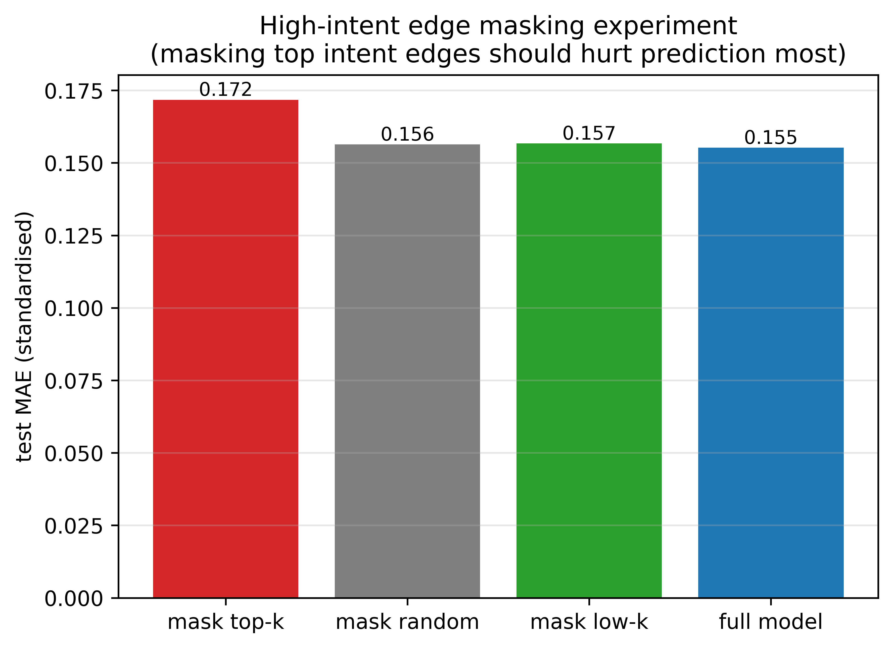


#### 20260628_021428

w=12 h=3

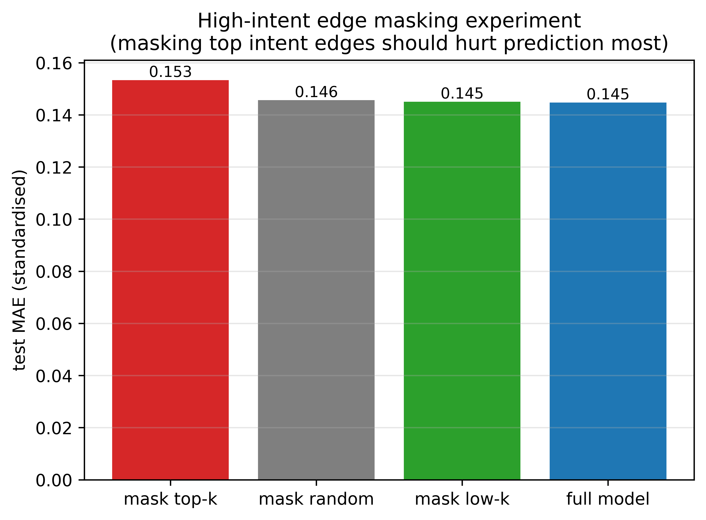

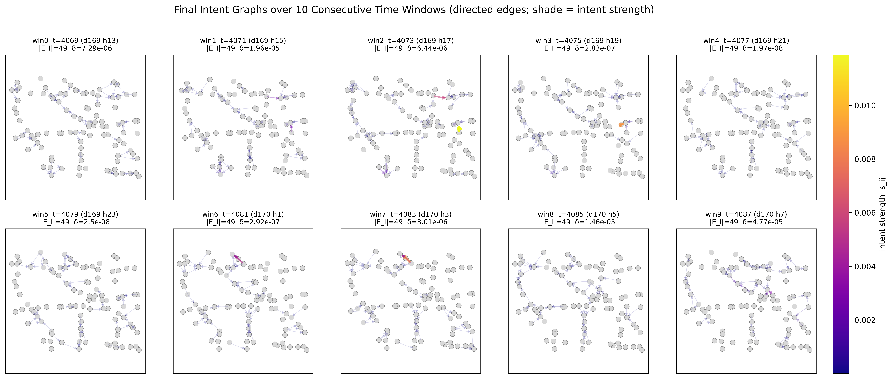

> 文件位置：[run_summary_20260627_224528.json](./260627/outputs/20260627_224528/run_summary_20260627_224528.json)
> 文件位置：[run_summary_20260628_022125.json](./260627/outputs/20260628_022125/run_summary_20260628_022125.json)
>
> 通过对比两个文件中的 hotspots_per_window 数据，我们可以观察到以下关键差异和可能含义：
>
> 1. 数值范围分布不同：
> - 第一个文件 (W=24, H=6)：hotspots_per_window 数值为 [5, 10, 3, 3, 5, 8, 9, 3, 5, 10]
> - 第二个文件 (W=3, H=1)：hotspots_per_window 数值为 [7, 6, 8, 8, 9, 8, 10, 10, 6, 10]
>
> 2. 窗口大小影响：
> - 第一个文件使用更大的窗口尺寸 (W=24, H=6)
> - 第二个文件使用更小的窗口尺寸 (W=3, H=1)
>
> 3. 可能的含义：
> - 小窗口 (W=3, H=1) 的热点分布更加均匀，数值集中在6-10之间，没有低于5的值
> - 大窗口 (W=24, H=6) 的热点分布波动更大，最小值只有3，最大值为10
> - 这表明较小的窗口可能更能捕捉局部热点特征，而较大的窗口可能会平滑掉一些局部热点
>
> 4. 性能相关性：
> - 小窗口模型的测试MAE (0.09157) 明显优于大窗口模型 (0.15520)
> - 这 suggests 热点分布的均匀性与模型性能可能存在正相关关系
>
> 5. 数据密度：
> - 两个文件的 intent_density_per_window 相同 (0.004949)
> - 这表明窗口大小变化没有改变整体的数据密度，但影响了热点的分布模式
>
> **这些差异表明窗口大小的选择对热点检测和模型性能有显著影响，较小的窗口可能更适合捕捉局部特征。**

#### 20260628_024449

w=3 h=1


#### 20260628_150956

不多次标准化：没啥区别

#### 20260628_152134

96天的展示

确实每小时的重点意图区域不同

#### 问题：

1. 算法原理：260627是固定特征+边分数学习→须升级成GAT-TCN
2. 怎么验证识别的有效
3. 是否需要换数据集
4. 图是颜色更换
5. 

## 260628

### 测试260628

#### 20260628_162448

##### d169是2025年6月18日 星期三

d173有极高的交通流 （）

##### 加入GAT-TCN后的结果对比

> 文件位置：[260628/outputs/20260628_162448/run_summary_20260628_162448.json](./260628/outputs/20260628_162448/run_summary_20260628_162448.json) 和 [260627/outputs/20260628_152134/run_summary_20260628_152134.json](./260627/outputs/20260628_152134/run_summary_20260628_152134.json)
>
> 这两个JSON文件记录了两个不同版本的DEIG-TCN模型的实验结果，对比分析如下：
>
> 1. **模型性能对比**：
>    - 260628版本（可训练GAT-TCN）：
>      - 测试MAE：0.0841
>      - 持久性基线MAE：0.2582
>    
>    - 260627版本（固定特征映射）：
>      - 测试MAE：0.0892
>      - 持久性基线MAE：0.2564
>
>    结论：260628版本（可训练GAT-TCN）的预测性能更好，MAE降低了约5.7%。
>
> 2. **边掩消融实验**：
>    - 260628版本：
>      - 完整模型：0.0841
>      - 掩码顶部（mask_top）：0.0856
>      - 随机掩码（mask_random）：0.0842
>      - 掩码底部（mask_low）：0.0841
>    
>    - 260627版本：
>      - 完整模型：0.0892
>      - 掩码顶部（mask_top）：0.0906
>      - 随机掩码（mask_random）：0.0895
>      - 掩码底部（mask_low）：0.0893
>
>    结论：两个版本都显示移除高意图边会降低性能，而260628版本对边掩消融的敏感性略低。
>
> 3. **意图密度分析**：
>    - 两个版本的意图密度完全相同：0.0049（约0.5%）
>    - 这表明两个模型在边选择策略上保持了一致性
>
> 4. **热点分析**：
>    - 260628版本每窗口热点数：3-12个，平均约7.2个
>    - 260627版本每窗口热点数：3-17个，平均约10.6个
>    
>    结论：260628版本识别的热点数量更少，但更集中，这可能反映了其时空编码器能够更精准地定位重要节点。
>
> 5. **实验设置一致性**：
>    - 两个实验使用相同的：
>      - 节点数(N)：100
>      - 时间步长(T)：5088
>      - 窗口大小(W)：3
>      - 预测步长(H)：1
>      - 候选边数：488
>      - 训练/验证/测试窗口数：3051/1017/1017
>      - 意图分位数阈值：0.9
>
> 总结：260628版本通过引入可训练的GAT-TCN编码器，不仅提高了预测精度，还使模型能够更精准地识别时空中的重要节点（热点），同时保持了相似的意图密度。这表明端到端的训练方式能够更好地捕捉时空数据的动态特征。

多了更多双向边

##### 验证方法

> # 1. 当前已经使用的验证方法
>
> ## 1.1 预测性能验证：DEIG-TCN vs persistence baseline
>
> 测试阶段先计算模型预测误差：
>
> $$
> \mathrm{MAE}_{\mathrm{DEIG}}
> =
> \frac{1}{NH}
> \sum_{i=1}^{N}
> \sum_{h=1}^{H}
> \left|
> \widehat z_i^{t+h}-z_i^{t+h}
> \right|.
> $$
>
> 同时用 persistence baseline 比较：
>
> $$
> \widehat z_i^{t+h}=z_i^t,
> $$
>
> 即假设未来等于当前。代码中会输出
>
> $$
> \mathrm{MAE}_{\mathrm{DEIG}}
> \quad\text{和}\quad
> \mathrm{MAE}_{\mathrm{persist}}.
> $$
>
> 如果
>
> $$
> \mathrm{MAE}_{\mathrm{DEIG}}
> <
> \mathrm{MAE}_{\mathrm{persist}},
> $$
>
> 说明整体模型确实从时空结构中学到了有用信息。这个验证是**模型整体有效性验证**，但还不是专门验证意图子图。fileciteturn0file0
>
> ---
>
> ## 1.2 边遮蔽消融：mask top / random / low
>
> 这是当前代码中最直接验证意图边有效性的方法。
>
> 测试阶段先得到每条候选边的意图分数：
>
> $$
> s_{ij}^t = \mathrm{EdgeIntentHead}
> \left(
> \mathbf z_i^t,\mathbf z_j^t,\mathbf e_{ij}^t
> \right).
> $$
>
> 然后按照分数排序，分别遮蔽：
>
> $$
> \text{Top }10\%\text{ 高意图边},
> $$
>
> $$
> \text{Random }10\%\text{ 随机边},
> $$
>
> $$
> \text{Low }10\%\text{ 低意图边}.
> $$
>
> 遮蔽方式是令对应边分数变为 0：
>
> $$
> s_{ij}^t \leftarrow 0.
> $$
>
> 然后重新预测并计算 MAE。理想结果应该满足：
>
> $$
> \boxed{
> \mathrm{MAE}_{\mathrm{mask\ top}}
> >
> \mathrm{MAE}_{\mathrm{mask\ random}}
> \gtrsim
> \mathrm{MAE}_{\mathrm{mask\ low}}.
> }
> $$
>
> 含义是：如果删除高意图边造成的预测性能下降最大，那么这些边确实对预测有关键贡献。当前 `main.py` 里正是这样计算 `mask_top`、`mask_random` 和 `mask_low` 的。fileciteturn0file0
>
> 这个方法验证的是：
>
> $$
> \boxed{
> \text{高 }s_{ij}^t\text{ 的边是否对预测更重要。}
> }
> $$
>
> 因此它是当前最核心的**有效性验证**。
>
> ---
>
> ## 1.3 意图图可视化与热点分析
>
> 当前代码还会选取连续测试窗口，计算每个窗口的边分数，然后用分位数阈值保留高分边：
>
> $$
> \delta_t=Q_{0.90}
> \left(
> \{s_{ij}^t:(i,j)\in E_0\}
> \right),
> $$
>
> $$
> E_I^t
> =
> \left\{
> (i,j)\in E_0:
> s_{ij}^t\geq \delta_t
> \right\}.
> $$
>
> 也就是说，当前意图子图大约保留候选边中最高的 $10\%$。代码还会计算意图图密度、热点子图数量，并输出连续窗口的可视化结果。fileciteturn0file0 fileciteturn0file6
>
> 这部分主要是**解释性和可视化验证**，用于观察：
>
> $$
> G_I^t
> $$
>
> 是否具有空间聚集性、方向性、热点结构和时间变化规律。
>
> ---
>
> ## 1.4 稀疏性与方向性约束
>
> 训练目标中还加入了两个结构正则项：
>
> $$
> \mathcal L_{\mathrm{sparse}}
> =
> \frac{1}{|E_0|}
> \sum_{(i,j)\in E_0}
> s_{ij}^t,
> $$
>
> 用于鼓励意图图稀疏；以及
>
> $$
> \mathcal L_{\mathrm{dir}}
> =
> \frac{1}{|\mathcal P|}
> \sum_{\{i,j\}\in\mathcal P}
> s_{ij}^t s_{ji}^t,
> $$
>
> 用于惩罚双向边同时高分。fileciteturn0file7
>
> 不过要注意：这两个正则项是**结构诱导机制**，不是严格意义上的验证方法。它们让意图图更稀疏、更有方向性，但不能单独证明意图边一定真实可靠。
>
> ---
>
> # 2. 当前验证的不足
>
> 当前验证已经有一个不错的闭环：
>
> $$
> s_{ij}^t
> \rightarrow
> \widetilde s_{ij}^t
> \rightarrow
> \mathbf g_j^t
> \rightarrow
> \widehat z_j^{t+h}
> \rightarrow
> \mathrm{MAE}.
> $$
>
> 但还存在几个不足。
>
> 第一，目前主要只做了 **10% 边遮蔽**，验证点比较单一。更稳健的做法应该看不同遮蔽比例下的完整曲线。
>
> 第二，随机遮蔽当前只做一次时，偶然性较大。更好的是重复 $R$ 次随机遮蔽，报告均值和置信区间：
>
> $$
> \mu_{\mathrm{rand}}(p)
> \pm
> 1.96
> \frac{\sigma_{\mathrm{rand}}(p)}{\sqrt R}.
> $$
>
> 第三，目前更多是在验证“高分边对预测有用”，但还没有充分验证：
>
> $$
> \text{意图边是否稳定、是否可复现、是否符合交通传播规律。}
> $$
>
> 第四，由于预测时使用入边归一化：
>
> $$
> \widetilde s_{ij}^t
> =
> \frac{s_{ij}^t}
> {\sum_{p:(p,j)\in E_0}s_{pj}^t+\varepsilon},
> $$
>
> 所以原始分数 $s_{ij}^t$ 的绝对值可能存在尺度问题。实践中更应该关注：
>
> $$
> \text{边分数排序}
> \quad\text{和}\quad
> \text{归一化后的相对权重}.
> $$
>
> ---
>
> # 3. 可以增加的可靠性与有效性验证方法
>
> 下面这些方法建议分成四类：**预测贡献验证、稳定性验证、结构合理性验证、外部一致性验证**。
>
> ---
>
> # A. 预测贡献类验证
>
> ## A1. 多比例删除曲线
>
> 不要只删除 top 10%，而是设置多个比例：
>
> $$
> p\in\{1\%,5\%,10\%,20\%,30\%,50\%\}.
> $$
>
> 分别计算：
>
> $$
> \Delta_{\mathrm{top}}(p)
> =
> \mathrm{MAE}_{\mathrm{mask\ top}(p)}
> -
> \mathrm{MAE}_{\mathrm{full}},
> $$
>
> $$
> \Delta_{\mathrm{rand}}(p)
> =
> \mathrm{MAE}_{\mathrm{mask\ rand}(p)}
> -
> \mathrm{MAE}_{\mathrm{full}},
> $$
>
> $$
> \Delta_{\mathrm{low}}(p)
> =
> \mathrm{MAE}_{\mathrm{mask\ low}(p)}
> -
> \mathrm{MAE}_{\mathrm{full}}.
> $$
>
> 如果意图边有效，应观察到：
>
> $$
> \boxed{
> \Delta_{\mathrm{top}}(p)
> >
> \Delta_{\mathrm{rand}}(p)
> >
> \Delta_{\mathrm{low}}(p)
> }
> $$
>
> 在多数 $p$ 上成立。
>
> 还可以计算删除曲线面积：
>
> $$
> \mathrm{AUC}_{\mathrm{del}}
> =
> \int_0^1
> \Delta_{\mathrm{top}}(p)\,dp.
> $$
>
> 越大表示高分边越关键。
>
> ---
>
> ## A2. 插入曲线：只保留 top 边
>
> 删除实验问的是：
>
> $$
> \text{去掉高分边会不会变差？}
> $$
>
> 插入实验问的是：
>
> $$
> \text{只保留高分边是否已经足够预测？}
> $$
>
> 定义只保留 top $p\%$ 边：
>
> $$
> s_{ij}^{t,p}
> =
> \begin{cases}
> s_{ij}^t,
> &
> (i,j)\in \mathrm{Top}_p,
> \\
> 0,
> &
> \text{otherwise}.
> \end{cases}
> $$
>
> 然后计算：
>
> $$
> \mathrm{MAE}_{\mathrm{keep\ top}(p)}.
> $$
>
> 如果较小的 $p$ 就能接近完整模型：
>
> $$
> \mathrm{MAE}_{\mathrm{keep\ top}(p)}
> \approx
> \mathrm{MAE}_{\mathrm{full}},
> $$
>
> 说明意图子图具有较强的**充分性**。
>
> 删除实验验证必要性，插入实验验证充分性。两者结合更完整：
>
> $$
> \boxed{
> \text{高意图边既必要，又充分。}
> }
> $$
>
> ---
>
> ## A3. 分数分桶校准验证
>
> 把边按照 $s_{ij}^t$ 分成若干分位桶：
>
> $$
> B_1,B_2,\ldots,B_K,
> $$
>
> 其中 $B_K$ 是最高分边，$B_1$ 是最低分边。分别遮蔽每个桶，计算误差增量：
>
> $$
> \Delta_k
> =
> \mathrm{MAE}_{\mathrm{mask}(B_k)}
> -
> \mathrm{MAE}_{\mathrm{full}}.
> $$
>
> 如果意图分数可靠，应当满足近似单调关系：
>
> $$
> \boxed{
> s\text{ 越高的桶}
> \Rightarrow
> \Delta_k\text{ 越大}.
> }
> $$
>
> 也就是：
>
> $$
> \Delta_1
> \leq
> \Delta_2
> \leq
> \cdots
> \leq
> \Delta_K.
> $$
>
> 这个方法比只看 top 10% 更有说服力。
>
> ---
>
> ## A4. 置乱检验
>
> 保持模型不变，只打乱边分数：
>
> $$
> s_{ij}^t
> \rightarrow
> s_{\pi(i,j)}^t.
> $$
>
> 如果原始意图分数是有意义的，则应满足：
>
> $$
> \mathrm{MAE}_{\mathrm{shuffle}}
> >
> \mathrm{MAE}_{\mathrm{full}}.
> $$
>
> 还可以做时间置乱：
>
> $$
> s_{ij}^t
> \rightarrow
> s_{ij}^{t'},
> \qquad t'\neq t.
> $$
>
> 若动态意图确实有时间意义，则：
>
> $$
> \mathrm{MAE}_{\mathrm{time\ shuffle}}
> >
> \mathrm{MAE}_{\mathrm{full}}.
> $$
>
> 这可以验证：
>
> $$
> \boxed{
> s_{ij}^t\text{ 不只是静态边重要性，而是有动态时间含义。}
> }
> $$
>
> ---
>
> ## A5. 反向边检验
>
> 把每条边的分数换成反向边分数：
>
> $$
> s_{ij}^t
> \leftarrow
> s_{ji}^t.
> $$
>
> 然后计算：
>
> $$
> \mathrm{MAE}_{\mathrm{reverse}}.
> $$
>
> 如果方向性真的有效，应该有：
>
> $$
> \boxed{
> \mathrm{MAE}_{\mathrm{reverse}}
> >
> \mathrm{MAE}_{\mathrm{full}}.
> }
> $$
>
> 这个实验专门验证：
>
> $$
> \text{模型学到的是有向传播，而不是无向相关。}
> $$
>
> ---
>
> ## A6. 与无意图模型对比
>
> 增加几个基线模型：
>
> ### 均匀入边权重
>
> $$
> \widetilde s_{ij}^t
> =
> \frac{1}{|\mathcal N_j^-|}.
> $$
>
> ### 只用静态候选图
>
> $$
> s_{ij}^t
> =
> \mathrm{constant}
> \quad\text{or}\quad
> s_{ij}=f(d_{ij},\rho_{ij}).
> $$
>
> ### 随机意图图
>
> $$
> s_{ij}^t\sim \mathrm{Uniform}(0,1).
> $$
>
> ### 无边消息传播
>
> $$
> \mathbf g_j^t=\mathbf 0.
> $$
>
> 如果完整模型显著优于这些版本：
>
> $$
> \mathrm{MAE}_{\mathrm{DEIG}}
> <
> \mathrm{MAE}_{\mathrm{uniform}},
> \quad
> \mathrm{MAE}_{\mathrm{static}},
> \quad
> \mathrm{MAE}_{\mathrm{random}},
> \quad
> \mathrm{MAE}_{\mathrm{no\ edge}},
> $$
>
> 就能证明动态意图子图确实带来了预测收益。
>
> ---
>
> # B. 稳定性与可复现性验证
>
> ## B1. 多随机种子一致性
>
> 用不同随机种子训练 $R$ 次，得到：
>
> $$
> G_{I,r}^t,
> \qquad r=1,\ldots,R.
> $$
>
> 比较 top 意图边集合的 Jaccard 相似度：
>
> $$
> J(r_1,r_2)
> =
> \frac{
> |E_{I,r_1}^t\cap E_{I,r_2}^t|
> }{
> |E_{I,r_1}^t\cup E_{I,r_2}^t|
> }.
> $$
>
> 如果平均相似度较高：
>
> $$
> \overline J
> =
> \frac{2}{R(R-1)}
> \sum_{r_1<r_2}J(r_1,r_2),
> $$
>
> 说明意图子图对初始化不敏感。
>
> 也可以比较边分数排序的 Spearman 相关：
>
> $$
> \rho_{\mathrm{rank}}
> =
> \operatorname{Spearman}
> \left(
> s^{(r_1)},s^{(r_2)}
> \right).
> $$
>
> ---
>
> ## B2. 时间邻近窗口稳定性
>
> 连续时间窗口的意图图不应该完全随机跳变。可以计算：
>
> $$
> J_t
> =
> \frac{
> |E_I^t\cap E_I^{t+1}|
> }{
> |E_I^t\cup E_I^{t+1}|
> }.
> $$
>
> 正常情况下，交通传播结构应该具有一定连续性：
>
> $$
> J_t
> $$
>
> 不应长期接近 0。
>
> 但也不能要求它恒定很高，因为早晚高峰、突发拥堵、异常波动会导致意图图变化。因此可以同时观察：
>
> $$
> J_t
> \quad\text{与}\quad
> \mathrm{traffic\ volatility}_t
> $$
>
> 之间的关系。若交通波动越大，意图图变化越明显，这是合理现象。
>
> ---
>
> ## B3. 数据扰动鲁棒性
>
> 对输入数据加入轻微扰动：
>
> $$
> \widetilde z_i^t
> =
> z_i^t+\epsilon_i^t,
> \qquad
> \epsilon_i^t\sim \mathcal N(0,\sigma^2).
> $$
>
> 或随机遮蔽少量观测值。重新推理得到：
>
> $$
> \widetilde s_{ij}^t.
> $$
>
> 计算：
>
> $$
> \operatorname{Corr}
> \left(
> s_{ij}^t,
> \widetilde s_{ij}^t
> \right)
> $$
>
> 以及 top 边 Jaccard 相似度。如果轻微扰动不会导致意图子图剧烈变化，说明可靠性更强。
>
> ---
>
> ## B4. 不同训练时间段验证
>
> 例如分别用不同月份或不同时间片训练模型：
>
> $$
> \mathcal D_1,\mathcal D_2,\ldots,\mathcal D_R.
> $$
>
> 比较它们在相同测试窗口上的意图图：
>
> $$
> G_{I,1}^t,G_{I,2}^t,\ldots,G_{I,R}^t.
> $$
>
> 如果主要高意图边在不同训练集上仍然稳定出现，说明不是偶然拟合。
>
> ---
>
> # C. 结构合理性验证
>
> ## C1. 方向非对称性指标
>
> 当前模型有方向正则，但可以额外报告方向非对称程度：
>
> $$
> A_{\mathrm{dir}}
> =
> \frac{
> \sum_{\{i,j\}}
> |s_{ij}^t-s_{ji}^t|
> }{
> \sum_{\{i,j\}}
> (s_{ij}^t+s_{ji}^t)+\varepsilon
> }.
> $$
>
> 如果
>
> $$
> A_{\mathrm{dir}}
> $$
>
> 过低，说明图接近无向；如果过高但预测没有提升，可能说明方向正则过强。
>
> 理想情况是：
>
> $$
> A_{\mathrm{dir}}\text{ 较高}
> \quad\text{且}\quad
> \mathrm{MAE}\text{ 较低}.
> $$
>
> ---
>
> ## C2. 稀疏性与性能联合曲线
>
> 改变阈值分位数：
>
> $$
> q\in\{0.70,0.80,0.85,0.90,0.95\}.
> $$
>
> 得到不同密度的意图图：
>
> $$
> E_I^t(q)
> =
> \{(i,j):s_{ij}^t\geq Q_q(s^t)\}.
> $$
>
> 观察热点、主干边和预测性能是否稳定。若只在某一个阈值下看起来合理，说明解释结果比较脆弱。
>
> ---
>
> ## C3. 节点级贡献验证
>
> 当前代码已经可以计算节点入意图、出意图和活跃度：
>
> $$
> I_i^{\mathrm{out}}
> =
> \sum_j A_{ij}^t,
> $$
>
> $$
> I_i^{\mathrm{in}}
> =
> \sum_j A_{ji}^t,
> $$
>
> $$
> I_i^{\mathrm{act}}
> =
> I_i^{\mathrm{out}}+I_i^{\mathrm{in}}.
> $$
>
> 可以进一步验证：遮蔽高活跃节点的出边，是否比遮蔽低活跃节点的出边造成更大误差。
>
> 定义：
>
> $$
> \Delta_i^{\mathrm{out}}
> =
> \mathrm{MAE}_{\mathrm{mask\ out}(i)}
> -
> \mathrm{MAE}_{\mathrm{full}}.
> $$
>
> 如果
>
> $$
> I_i^{\mathrm{out}}
> $$
>
> 与
>
> $$
> \Delta_i^{\mathrm{out}}
> $$
>
> 正相关，说明“源节点”解释具有预测意义。
>
> ---
>
> # D. 外部一致性验证
>
> 如果有道路拓扑、车道方向、路网距离或真实传播链，可以做更强验证。
>
> ## D1. 与滞后相关一致性
>
> 候选边本身已经包含方向滞后相关：
>
> $$
> \rho_{i\to j}^{\mathrm{lag}}
> =
> \max_{\tau}
> \operatorname{Corr}
> \left(
> z_i^{t-\tau},z_j^t
> \right).
> $$
>
> 可以检验：
>
> $$
> s_{ij}^t
> $$
>
> 是否与
>
> $$
> \rho_{i\to j}^{\mathrm{lag}}
> $$
>
> 在统计上正相关：
>
> $$
> \operatorname{Spearman}
> \left(
> s_{ij}^t,
> \rho_{i\to j}^{\mathrm{lag}}
> \right)>0.
> $$
>
> 更重要的是比较方向差异：
>
> $$
> \Delta \rho_{ij}
> =
> \rho_{i\to j}^{\mathrm{lag}}
> -
> \rho_{j\to i}^{\mathrm{lag}}.
> $$
>
> 如果
>
> $$
> \Delta \rho_{ij}>0
> $$
>
> 时更容易出现
>
> $$
> s_{ij}^t>s_{ji}^t,
> $$
>
> 则说明意图方向与滞后传播方向一致。
>
> ---
>
> ## D2. 与道路物理方向一致性
>
> 如果有道路上下游关系，可以定义真实方向标签：
>
> $$
> y_{ij}
> =
> \begin{cases}
> 1,& i\to j\text{ 是真实下游传播方向},\\
> 0,& \text{otherwise}.
> \end{cases}
> $$
>
> 然后用 $s_{ij}^t$ 做边分类分数，计算：
>
> $$
> \mathrm{AUC},
> \quad
> \mathrm{Precision@K},
> \quad
> \mathrm{Recall@K}.
> $$
>
> 例如：
>
> $$
> \mathrm{Precision@K}
> =
> \frac{
> |\mathrm{TopK}(s)\cap E_{\mathrm{true}}|
> }{
> K
> }.
> $$
>
> 这是最强的可靠性验证之一。
>
> ---
>
> ## D3. 与 Granger 因果或 Transfer Entropy 对比
>
> 可以用传统时间序列方法独立构造参考图：
>
> $$
> E_{\mathrm{GC}},
> \quad
> E_{\mathrm{TE}}.
> $$
>
> 然后比较：
>
> $$
> \mathrm{Overlap}
> =
> \frac{
> |E_I^t\cap E_{\mathrm{GC}}|
> }{
> |E_I^t|
> }.
> $$
>
> 或者比较排序相关：
>
> $$
> \operatorname{Spearman}
> \left(
> s_{ij}^t,
> \mathrm{GC}_{ij}
> \right).
> $$
>
> 注意这不是要求二者完全一致，因为 DEIG-TCN 的 $s_{ij}^t$ 是预测任务驱动的动态依赖，不等同于严格因果。但如果两者高度冲突，就需要进一步检查模型解释是否可信。
>
> ---
>
> # 4. 我最建议你补充的验证组合
>
> 如果要让论文或实验更有说服力，我建议至少补这五个：
>
> ## 第一，删除曲线
>
> $$
> p=1\%,5\%,10\%,20\%,30\%,50\%.
> $$
>
> 报告：
>
> $$
> \Delta_{\mathrm{top}}(p),
> \quad
> \Delta_{\mathrm{rand}}(p),
> \quad
> \Delta_{\mathrm{low}}(p).
> $$
>
> ## 第二，插入曲线
>
> 只保留 top $p\%$ 意图边，看少量高分边是否足以维持预测性能。
>
> ## 第三，随机重复与置信区间
>
> 随机遮蔽重复 $R=30$ 或 $R=50$ 次：
>
> $$
> \mathrm{MAE}_{\mathrm{rand}}
> =
> \mu\pm 95\%\mathrm{CI}.
> $$
>
> ## 第四，多种模型消融
>
> 至少比较：
>
> $$
> \text{Full DEIG-TCN},
> $$
>
> $$
> \text{without dynamic intent},
> $$
>
> $$
> \text{uniform edge weights},
> $$
>
> $$
> \text{static KNN only},
> $$
>
> $$
> \text{shuffled scores},
> $$
>
> $$
> \text{reverse scores}.
> $$
>
> ## 第五，多随机种子稳定性
>
> 报告：
>
> $$
> \mathrm{Jaccard@TopK},
> \quad
> \mathrm{Spearman}(s^{(r_1)},s^{(r_2)}).
> $$
>
> ---
>
> # 5. 可以形成的最终验证结论模板
>
> 如果补完这些实验，意图子图可靠性可以从三个层面证明：
>
> $$
> \boxed{
> \text{有效性}
> }
> $$
>
> 高意图边被删除后预测误差显著上升：
>
> $$
> \Delta_{\mathrm{top}}
> >
> \Delta_{\mathrm{random}}
> >
> \Delta_{\mathrm{low}}.
> $$
>
> $$
> \boxed{
> \text{稳定性}
> }
> $$
>
> 不同随机种子、不同训练切分、轻微数据扰动下，top 意图边保持较高重合：
>
> $$
> Jaccard@K \text{ 较高},
> \quad
> Spearman(s)\text{ 较高}.
> $$
>
> $$
> \boxed{
> \text{合理性}
> }
> $$
>
> 高意图边与滞后相关、道路方向、物理邻近、热点传播区域相一致：
>
> $$
> s_{ij}^t
> \leftrightarrow
> \rho_{i\to j}^{\mathrm{lag}},
> \quad
> \text{road direction},
> \quad
> \text{traffic hotspots}.
> $$
>
> ---
>
> # 6. 一句话总结
>
> 当前方法主要通过：
>
> $$
> \boxed{
> \text{mask top / random / low 意图边后的 MAE 变化}
> }
> $$
>
> 来验证意图子图是否有效。这个方向是正确的，但还不够充分。更完整的验证应增加：
>
> $$
> \boxed{
> \text{删除曲线、插入曲线、置乱检验、反向边检验、多种模型消融、多随机种子稳定性、外部交通规律一致性}
> }
> $$
>
> 这样才能同时证明意图子图的：
>
> $$
> \boxed{
> \text{预测有效性}
> +
> \text{统计可靠性}
> +
> \text{交通解释合理性}.
> }
> $$
>
> -----
>
> > [文件不支持导出]
> > 这个实验结果你觉得如何
>
> 我先把这次运行的关键指标、边遮蔽结果和意图图稳定性一起检查一下，再给你一个“现在能说明什么、还不能说明什么”的判断。
>
> 目前已经有一个很清楚的积极信号：删除高分边的影响远大于随机边，而删除低分边几乎没有影响。不过，我还在核对这个差异到底有多强，以及哪些现象其实是阈值设定“固定出来”的。
>
> 整体看，我会把这次结果评价为：
>
> $$
> \boxed{\text{预测效果很好，意图边有效性出现了明确正信号，但可靠性证据还属于初步阶段。}}
> $$
>
> 作为一次可行性实验，我认为是成功的；但要作为论文中“意图子图可靠”的核心证据，目前还不够扎实。
>
> ## 1. 最值得肯定的结果
>
> 测试集上：
>
> $$
> \mathrm{MAE}_{\mathrm{DEIG}}=0.08411,
> \qquad
> \mathrm{MAE}_{\mathrm{Persistence}}=0.25824.
> $$
>
> 相对 persistence，误差降低了
>
> $$
> \frac{0.25824-0.08411}{0.25824}
> \approx 67.43\%.
> $$
>
> 也就是说，模型误差只有 persistence 的约
>
> $$
> 32.57\%.
> $$
>
> 这个提升非常明显，说明模型确实学习到了比“未来等于当前”更强的预测规律。当前实验包含 100 个节点、488 条候选边和 1017 个测试窗口，测试规模也不算太小。fileciteturn1file0L11-L27
>
> 不过，MAE 是标准化空间中的误差，所以暂时还不能直接解释为实际交通流量单位中的误差。
>
> ## 2. 意图边消融结果是“方向正确”的
>
> 消融结果为：
>
> | 实验                |      MAE | 相对完整模型变化 |
> | ------------------- | -------: | ---------------: |
> | 完整模型            | 0.084111 |                — |
> | 删除 Top 10% 意图边 | 0.085581 |       $+1.748\%$ |
> | 删除随机 10% 边     | 0.084201 |       $+0.107\%$ |
> | 删除 Low 10% 意图边 | 0.084111 |         约 $0\%$ |
>
> 而且，高分边删除造成的误差增量约为随机删除的
>
> $$
> \frac{0.085581-0.084111}
> {0.084201-0.084111}
> \approx 16.39
> $$
>
> 倍。
>
> 因此出现了非常理想的排序关系：
>
> $$
> \boxed{
> \mathrm{MAE}_{\mathrm{mask\ top}}
> >
> \mathrm{MAE}_{\mathrm{mask\ random}}
> >
> \mathrm{MAE}_{\mathrm{mask\ low}}
> }
> $$
>
> 这说明边分数至少具备不错的**预测贡献排序能力**：模型给高分的边确实比低分边更重要。fileciteturn1file0L21-L27
>
> 但也要客观看待：删除最高 10% 边只造成约 $1.75\%$ 的相对退化，属于“明确但幅度不大”。所以目前更适合表述为：
>
> $$
> \boxed{\text{高意图边具有显著更高的相对重要性}}
> $$
>
> 而不是直接说：
>
> $$
> \text{意图子图已经完全恢复了真实交通传播结构。}
> $$
>
> ## 3. Low 边完全无影响既是好现象，也需要警惕
>
> 删除最低 10% 边后，MAE 与完整模型完全相同。这可能意味着模型成功把大量无用边压到了接近零，高分边和低分边分离得很好。
>
> 但还存在另一种解释：预测时使用的是入边归一化权重，
>
> $$
> \widetilde s_{ij}
> =
> \frac{s_{ij}}
> {\sum_p s_{pj}+\varepsilon},
> $$
>
> 而训练又对原始分数施加稀疏正则。模型可能把所有原始分数整体压小，只保留相对排序。因此，最低分边可能已经小到几乎没有任何数值贡献。
>
> 所以还需要同时检查：
>
> $$
> s_{ij}\text{ 的分布},
> \qquad
> \widetilde s_{ij}\text{ 的分布},
> $$
>
> 特别是最大值、均值、分位数、熵和每个节点的有效入边数量。
>
> ## 4. 意图图密度恒定不是稳定性的证据
>
> 97 个窗口中的意图图密度全部是
>
> $$
> 0.00494949.
> $$
>
> 对于 $N=100$，可能的非自环有向边数为
>
> $$
> 100\times99=9900.
> $$
>
> 因此每个窗口保留的边数是
>
> $$
> 0.00494949\times9900=49.
> $$
>
> 候选边总数为 488，所以每个窗口固定保留约
>
> $$
> \frac{49}{488}=10.04\%
> $$
>
> 的候选边。这恰好来自 $q=0.90$ 的分位数阈值，而不是模型自动学出了稳定密度。换句话说：
>
> $$
> \boxed{\text{密度恒定是阈值机制决定的，不是实验发现。}}
> $$
>
> 代码也是对每个窗口使用第 90 百分位阈值后，再用保留边数除以 $N(N-1)$。fileciteturn2file0L49-L57
>
> 热点数量在 97 个窗口中从 3 到 12 变化，平均约为
>
> $$
> 6.54\pm1.79,
> $$
>
> 说明虽然边数固定，但边的空间组合和连通结构可能在变化。这是一个不错的动态性信号。fileciteturn1file1L60-L157
>
> 不过，仅看热点数量还不能证明图真的在合理变化。需要进一步计算连续窗口的边集合重合度：
>
> $$
> J_t=
> \frac{|E_I^t\cap E_I^{t+1}|}
> {|E_I^t\cup E_I^{t+1}|},
> $$
>
> 以及边分数时间相关性。
>
> ## 5. 当前最重要的技术问题：动态滞后特征实际没有生效
>
> 这次实验设置为：
>
> $$
> W=3,\qquad H=1.
> $$
>
> 也就是只使用 3 个历史时刻预测下一个时刻。fileciteturn3file1L63-L74
>
> 但是动态滞后相关函数规定：参与相关系数计算的序列长度小于 4 时，直接跳过：
>
> $$
> \texttt{if x.size < 4: continue}.
> $$
>
> 当 $W=3$ 时，即使滞后量为 1，也只有
>
> $$
> |x|=W-1=2<4.
> $$
>
> 因此所有窗口中都会得到
>
> $$
> D_{ij}^t=0,
> \qquad
> D_{ij}^t-D_{ji}^t=0.
> $$
>
> 也就是说，当前 6 维动态边特征中的前两维：
>
> $$
> \left[
> D_{ij}^t,\,
> D_{ij}^t-D_{ji}^t
> \right]
> $$
>
> 实际上始终为零。fileciteturn3file0L11-L22 fileciteturn3file0L34-L50
>
> 这是当前实验最值得优先修正的问题。现在的模型仍然具有动态性，因为节点时空表示、异常强度和趋势特征随窗口变化，但它并没有真正验证你设计的“窗口级方向滞后相关”机制。
>
> 至少需要：
>
> $$
> W\geq5
> $$
>
> 才能让滞后 1 的相关系数有机会计算；若希望滞后 1、2、3 都有至少 4 个样本，则应满足：
>
> $$
> W-\tau_{\max}\geq4
> \quad\Longrightarrow\quad
> W\geq7.
> $$
>
> 更合理的设置可以是：
>
> $$
> W\in\{12,24\},
> \qquad
> H\in\{1,3,6\}.
> $$
>
> ## 6. 预处理存在重复执行
>
> `load_csv()` 内部已经执行了一次 `Preprocessor.fit_transform()`，并将标准化后的 $Z$ 重新作为 `TrafficData.X` 返回。fileciteturn4file0L33-L51
>
> 随后主程序又执行了一次：
>
> $$
> \texttt{Preprocessor(...).fit\_transform(data)}.
> $$
>
> fileciteturn4file1L74-L82
>
> 因此当前数据至少经过了两次预处理。第二次标准化本身可能接近恒等变换，但分位数截断也会被重复执行，可能进一步压缩异常值，并影响最终 MAE 和异常传播特征。
>
> 建议让 `load_csv()` 只负责：
>
> $$
> \text{读取数据}+\text{缺失值基础处理},
> $$
>
> 所有标准化、截断和周期残差计算只在主程序中统一执行一次。
>
> ## 7. 当前遮蔽方式还需要改进
>
> 现在是把所有测试窗口的边分数拼成一个整体，然后从全部“窗口—边实例”中统一选 Top 10%、Low 10% 和一次随机 10%。fileciteturn2file0L18-L35
>
> 这可能导致高分边主要集中在少数窗口，最终 MAE 增量不能完全代表每个窗口的稳定规律。
>
> 更稳健的方法是对每个测试窗口分别执行：
>
> $$
> \Delta_t^{\mathrm{top}}
> =
> \mathrm{MAE}_t^{\mathrm{mask\ top}}
> -
> \mathrm{MAE}_t^{\mathrm{full}},
> $$
>
> 然后报告：
>
> $$
> \overline{\Delta}^{\mathrm{top}},
> \quad
> \operatorname{median}(\Delta_t^{\mathrm{top}}),
> \quad
> 95\%\text{置信区间}.
> $$
>
> 随机遮蔽应重复至少 30 次：
>
> $$
> \Delta_{\mathrm{random}}^{(1)},\ldots,
> \Delta_{\mathrm{random}}^{(30)}.
> $$
>
> 由于这些窗口高度重叠，置信区间最好使用时间块 bootstrap，而不是把 1017 个窗口视为完全独立样本。
>
> ## 综合评价
>
> 我会分别给出两个评价：
>
> $$
> \boxed{\text{作为模型可行性实验：7.5/10}}
> $$
>
> 原因是预测提升非常大，而且遮蔽结果满足理想排序，高意图边明显比随机边和低意图边重要。
>
> $$
> \boxed{\text{作为意图子图可靠性证明：5/10}}
> $$
>
> 原因是目前只有一次运行、一个预测步长、一个遮蔽比例、一次随机遮蔽；图密度是阈值固定的；更关键的是 $W=3$ 导致动态滞后相关特征完全失效，同时预处理还执行了两次。
>
> 最准确的实验结论可以写成：
>
> > 当前实验表明，DEIG-TCN 在单步预测任务上明显优于 persistence 基线，且边意图分数能够有效区分高贡献边和低贡献边。删除高意图边造成的误差增量约为随机边的 16.4 倍，说明意图评分具有初步的预测有效性。但由于窗口长度较短、动态滞后特征未实际激活、随机消融次数不足以及缺少多种子和外部结构验证，目前结果应视为意图子图可靠性的初步证据，而非最终结论。


#### 20260628_181022

w=12,h=1

效果极差

## 260708

### 测试260706

**已加入因果意图融合**

当前意图图保存的 intent_graphs_data 是只有show时间步的

修改了读取的数据集的问题，但是输出的演示图片不太理解，且节点布局有问题

绘制箭头方向反了

`@file ratcgf/viz_inputs.py` `@file ratcgf/viz_causal_style.py` `@file ratcgf/visualize.py` `@file ratcgf/views.py` `@file ratcgf/main.py`  1. 260706\ratcgf\outputs\run_20260709_110315\figures\views_target_ref 下的 view_ref_causal_inactive因果方向不对 2. 输入的意图图、意图残差图、因果意图共识图、意图持续图、意图新增图、意图消退图都标明日期和小时  3.所有绘图，被选中的节点（有边的）都标红，白框红底白字，大小表示节点初度、入度，出度、入度越大节点越大；未选中的节点一律用灰色表示； 因果边用红白蓝过度色条，红色表示正因果影响，蓝色表示负因果影响，0处是白色  3. 画框不要用正方形，匹配节点坐标分布的横纵比例，应该是个长方向

### 测试260706_2

#### **调整绘图问题**

> ## 一、节点大小
>
> 节点大小都是"基础值 + 按某个强度归一化后的增量",公式各图不同:
>
> | 图 / 函数                                   | 文件:行                     | 设置代码                                      | 说明                                                    |
> | ------------------------------------------- | --------------------------- | --------------------------------------------- | ------------------------------------------------------- |
> | 参考样式(输入因果/意图、`views_target_ref`) | `viz_causal_style.py:130`   | `sizes = 100 + (strength / vmax_n) * 300`     | 最小 100,最大 400;`strength`=该节点所连边 \|效应\| 之和 |
> | `views_97steps` 各视图                      | `visualize.py:139`          | `sizes = 10 + 60 * (deg / (deg.max()+_EPS))`  | 最小 10,最大 70;按节点度                                |
> | 融合图 `fused_SD`(右图)                     | `visualize.py:191`          | `sizes = 15 + 120 * (sc-sc.min())/(...)`      | 按 node score                                           |
> | 部署子图 候选点/已部署点                    | `visualize.py:210` / `:231` | `s=12`(灰色候选) / `s=90`(红色部署)           | 固定值                                                  |
> | `viz_inputs.py` 因果/意图/并排              | `viz_inputs.py:105`         | `sizes = 25 + 130 * (ns-ns.min())/(rng+1e-8)` | 最小 25,最大 155                                        |
>
> 改法举例:想让参考样式节点整体变大,把 `viz_causal_style.py:130` 的 `100` 和 `300` 调大即可(前者是下限,后者是浮动幅度)。
>
> ## 二、线宽
>
> 要分清两种"线":**箭头/边线本身的粗细** 和 **节点白色描边(边框)的粗细**。
>
> **边线粗细:**
>
> | 图 / 函数                         | 文件:行                                                | 设置代码                                                     |
> | --------------------------------- | ------------------------------------------------------ | ------------------------------------------------------------ |
> | 参考样式(nx 画边)                 | `viz_causal_style.py:118-119`(默认参数) + `:179`(计算) | `base_width=1.0`、`width_scale=5.0`;`width = base_width + abs(val)*width_scale` |
> | `views_97steps`/融合(quiver 箭头) | `visualize.py:87`(默认 `width=0.004`)、`:109`          | quiver 的 `width` 是相对轴宽的比例,不是磅值                  |
> | 部署子图(quiver 箭头)             | `visualize.py:222`                                     | `width=0.005`                                                |
> | `viz_inputs.py`(nx 画边)          | `viz_inputs.py:112`                                    | `widths = 0.4 + 2.8 * np.abs(w)/wabs`                        |
>
> **节点白色描边粗细(第 5 点要求的白框):**
>
> | 图                       | 文件:行                     | 代码             |
> | ------------------------ | --------------------------- | ---------------- |
> | 参考样式节点             | `viz_causal_style.py:146`   | `linewidths=1.0` |
> | `views_97steps`/融合散点 | `visualize.py:146` / `:195` | `linewidths=0.6` |
> | 部署点白框               | `visualize.py:232`          | `linewidths=1.0` |
> | `viz_inputs.py` 节点     | `viz_inputs.py:145`         | `linewidths=0.6` |
>
> 另外箭头头部大小在 quiver 的 `headwidth/headlength`(如 `visualize.py:110`)、nx 边的 `arrowsize`(`viz_causal_style.py:182` 为 12)控制,和线宽是分开的参数。
>
> ## 三、字体大小
>
> 字体是**两层**控制,建议优先改常量:
>
> **第 1 层——每个模块顶部的字号常量(改这里最省事,影响该模块所有图):**
>
> - `viz_causal_style.py:36-39` → `_TITLE_FS=16`、`_LABEL_FS=14`、`_NODE_LABEL_FS=14`、`_TICK_FS=12`
> - `visualize.py:53-56` → `_TITLE_FS=15`、`_LABEL_FS=13`、`_TICK_FS=11`、`_NODE_LABEL_FS=12`
> - `viz_inputs.py:33-36` → 同 visualize 一套
>
> 这四个常量分别对应:标题、坐标轴/色条标签、节点标签、刻度/色条刻度。它们被各处的 `fontsize=_XXX_FS` 引用(标题如 `viz_causal_style.py:234`;节点标签如 `:155` 和 `visualize.py:129`、`viz_inputs.py:149`;色条如 `:204-205`)。
>
> **第 2 层——全局 rcParams 默认值(兜底,凡是没显式指定 fontsize 的文字都吃这套):**
>
> - `main.py:92-98`(主流程运行时设置):`font.size=15`、`axes.titlesize=17`、`axes.labelsize=15`、`xtick/ytick=13`、`legend=13`、`figure.titlesize=19`
> - 各模块内的 `_apply_rc()`:`viz_causal_style.py:52-58`、`visualize.py:67-72`、`viz_inputs.py:48-53`——把上面的常量写进 rcParams,保证单独运行某个模块时也生效。
>
> 一个注意点:`main.py` 的 rcParams(15/17/…)和各模块常量(16/14/…、15/13/…)是**两套数值**,标题这类显式写了 `fontsize=_TITLE_FS` 的地方以模块常量为准,`main.py` 的 rcParams 只在没显式指定时兜底。要全局统一放大,最稳妥是同时把模块常量和 `main.py:92-98` 一起调,或者干脆把各处 `fontsize=_XXX_FS` 去掉、只留 rcParams 一套来源。
>
> 需要的话,我可以把这三类参数统一抽到一个配置区(比如一个 `style.py` 或 config 里的字段),这样只改一处就能全局生效,避免现在多套数值分散的情况。

#### run_20260709_162857

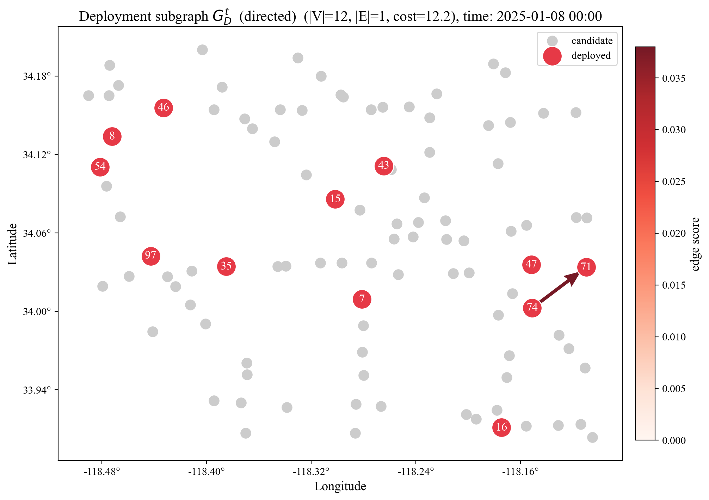

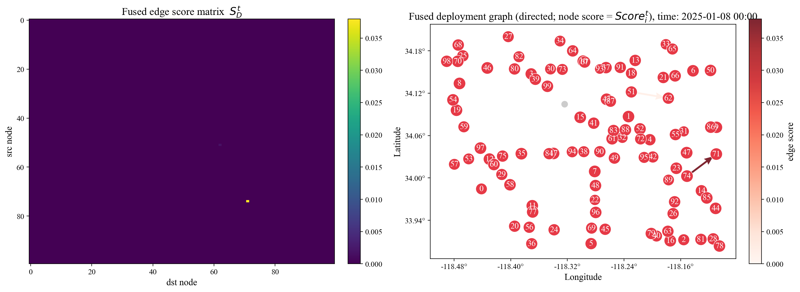

1. fused_SD 是怎么来的，获得的融合权重和部署图有什么关系

> $S_D^t$ 的**来源**以及它和**部署图$G_D^t$** 的关系说清楚。
>
> ## 一、$S_D^t$ 是怎么来的
>
> (S_D^t)（融合边分数矩阵）是整个 RA-TCGF 模型前向传播四个模块串联的产物。看 `model.py` 的 `RATCGF.forward`，链路如下：
>
> **模块 1（残差视图构建）** — `build_views`
> 输入因果图 (A_C) 和三个时刻的意图图 $A_I^{t-r}, A_I^t, A_I^{t+r}$，构造出候选视图集 `views`$C、I、CI、R、CmI、P、N$、消退视图 `decay`、结构统计 `q_struct`。同时用 `candidate_edge_index` 取候选边、`edge_feature_tensor` 生成逐边特征 (b_{ij})。
> **模块 2（时空编码）** — `MultiViewEncoder`
> 输入历史流量序列 `Xseq [L,N,F]` 和各视图，输出每视图的节点表征 (H_m^t) 和视图级摘要 (g_m^t)：
>
> ```python
> H, g = self.encoder(sample["Xseq"], views)
> ```
>
> **模块 3（主导性门控 → (S_D^t)）** — `DominanceGating`
> 这是 (S_D^t) 真正生成的地方。它把结构统计 `q_struct`、节点表征 `H`、视图摘要 `g`、视图、消退、候选边、边特征 (b_{ij}) 全部喂进去，输出门控权重和融合边分数：
>
> ```python
> gate = self.gating(q_struct, H, g, views, decay, edge_index, b_ij)
> ...
> "S_D": gate["S_D"], "s_edge": gate["s_edge"],
> "pi": gate["pi"], "gamma": gate["gamma"], "omega": gate["omega"],
> ```
>
> 这里的 `pi`、`gamma`、`omega` 就是你问的"融合权重"——它们是门控网络算出的、对各视图/各边的加权系数，用来把多个视图的边证据融合成单一的 (S_D^t)。（`module3_gating.py` 你没上传，所以具体融合公式看不到，但从接口能确定：(S_D^t) = 门控权重对多视图边证据的加权融合。）
> **节点分数** — `node_scores`
>
> ```python
> h_D = gate["h_D"]
> mlp_term = self.score_head(h_D)
> node_sc = node_scores(gate["S_D"], mlp_term)
> ```
>
> 节点分数 $Score_i^t$ 由融合表征 $h_D$ 过 MLP 的项，加上 $S_D^t$ 的某种聚合共同决定。
>
> 所以一句话：**$S_D^t$ = 四模块前向的输出，核心是模块 3 用门控权重$(\pi,\gamma,\omega)$把多视图边证据融合成的单一有向加权边分数矩阵。**
>
> 补充一点训练侧的背景（`train.py`）：模型是自监督训练的，损失为下一时刻流量预测的 MSE 加上 $S_D^t$ 的 L1 稀疏正则：
> $
> \mathcal{L} = \text{MSE}(\hat y,\ y) + \lambda \cdot \frac{1}{|S_D|}\sum |S_D^t|
> $
> 这个稀疏项会压制 (S_D^t) 里的弱边，让融合分数矩阵更"干净"，间接影响部署时的候选边质量。
>
> ## 二、融合权重 / $S_D^t$ 和部署图 $G_D^t$ 的关系
>
> 关系是**上游 → 下游**：$S_D^t$ 和 $Score_i^t$ 是部署算法的**输入打分**，`greedy_deploy`（`deploy.py`）拿它们在预算约束下贪心地挑节点和边，产出 $G_D^t$。
>
> 看 `deploy.py` 的 `greedy_deploy`，分两阶段：
> **第一阶段——选节点（用 $Score_i^t$）**
> 按节点分数从高到低排序，逐个加入，直到花掉预算的 70%（预留剩下给边）：
>
> ```python
> order = np.argsort(-node_scores)
> for i in order:
>     if cost + c_node <= B * 0.7:
>         selected.append(int(i)); cost += c_node
>     if cost >= B * 0.7:
>         break
> ```
>
> 即节点选择只看 $Score_i^t$，受节点成本 $c_i$ 和预算上限 (0.7B) 约束。
>
> **第二阶段——选边（用 $S_D^t$）**
> 把 $S_D^t > 0$的候选边按融合分数降序排，只有**两个端点都已被选中**的边才允许部署，且总花费不能超预算 (B)：
>
> ```python
> ii, jj = np.where(S_dense > 0)
> cand = [(a, b, S_dense[a,b]) ...]; cand.sort(key=lambda x: -x[2])
> for i, j, s in cand:
>     if i in sel_set and j in sel_set:
>         if cost + c_edge <= B:
>             edges.append((i, j)); cost += c_edge
> ```
>
> 这正好对应文件头部注释里的整数规划约束：
> $
> \sum_i c_i p_i + \sum_{ij} c_{ij} q_{ij} \le B,\qquad q_{ij}\le p_i,\ \ q_{ij}\le p_j
> $
> （边要被部署，其两端节点必须都被部署）。贪心策略是这个精确整数规划的近似替代。
>
> **效用回报**——用 $S_D^t$ 和视图算部署质量：
>
> ```python
> u_track = jaccard(A_dep, I>0) + jaccard(A_dep, P>0)
> "deployed_score": sum(S_dense[i,j] for i,j in edges)
> ```
>
> `deployed_score` 就是被部署边的融合分数之和，衡量"部署方案吃到了多少融合证据"。
>
> ## 三、把整条链路串起来
>
> $$
> \underbrace{(A_C,\ A_I^{t-r:t+r},\ X)}*{\text{输入}}
> \xrightarrow{\text{模块1-2}}
> \underbrace{(H,\ g,\ b*{ij})}*{\text{多视图表征}}
> \xrightarrow[\pi,\gamma,\omega]{\text{模块3 门控融合}}
> \underbrace{S_D^t,\ Score_i^t}*{\text{融合打分}}
> \xrightarrow[\text{预算 }B]{\text{模块4 贪心}}
> \underbrace{G_D^t}_{\text{部署图}}
> $$
>
> 要点对照：
>
> | 量                           | 生成于                            | 在部署里的角色                                     |
> | ---------------------------- | --------------------------------- | -------------------------------------------------- |
> | 融合权重 (\pi,\gamma,\omega) | 模块 3 门控                       | 决定各视图边证据如何融合成 (S_D^t)（不直接进部署） |
> | (S_D^t)                      | 模块 3 输出                       | 部署第二阶段**选边**的打分 + 效用计算              |
> | (Score_i^t)                  | `node_scores`（(S_D^t) + MLP 项） | 部署第一阶段**选节点**的打分                       |
> | (G_D^t)                      | `greedy_deploy`                   | 最终部署方案（受预算 (B) 约束）                    |
>
> 这也回答了你上一个问题的悬念：`plot_deployment_subgraph` 里画的 `deploy["nodes"]`，正是这里第一阶段按 (Score_i^t) 贪心选出来的节点；`deploy["edges"]` 是第二阶段按 (S_D^t) 选出的边。而 `fused_SD` 右图那个 `active` 掩码跟这套预算贪心毫无关系，只是显示高亮——所以两张图的红点通常对不上。
>
> 需要我画一张从输入到 (G_D^t) 的模块数据流示意图吗？可以把 (S_D^t)、(Score_i^t)、融合权重和部署两阶段的依赖关系可视化出来。


2. run_20260709_162857\figures\views_target_ref==当前的掩码具体是怎么计算实现的==，怎么有的深线条粗，有的细 (先暂不管这个问题，run_20260709_162857\views_97steps看不出来)

   第一个时间步的意图持续、意图新增图、意图消退图都是怎么算出来的

   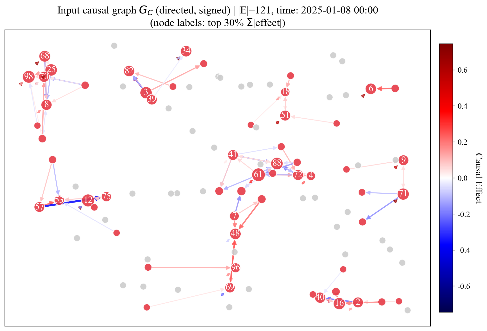

   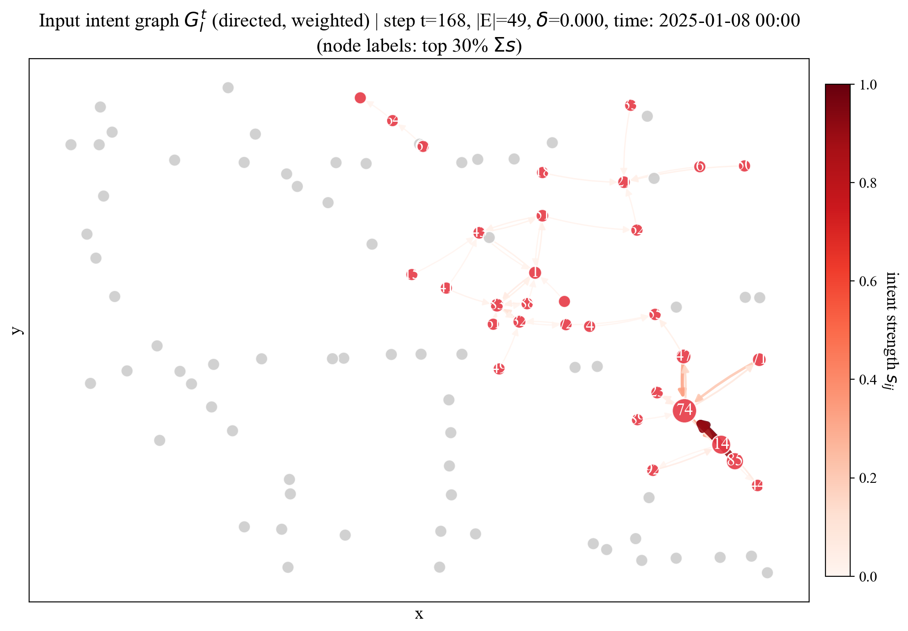

   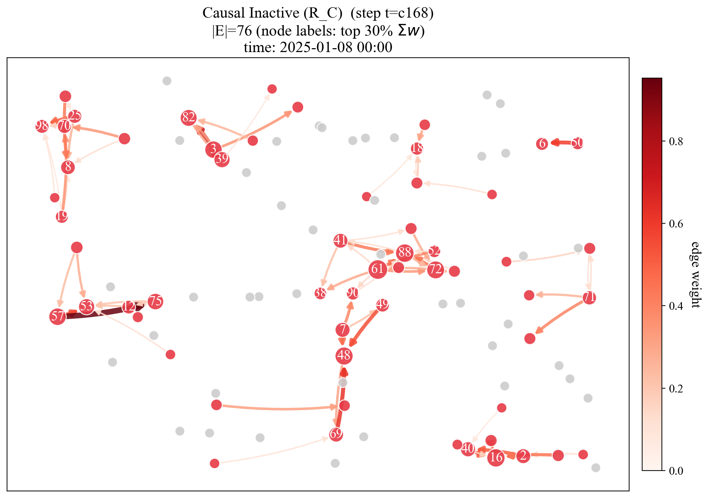

   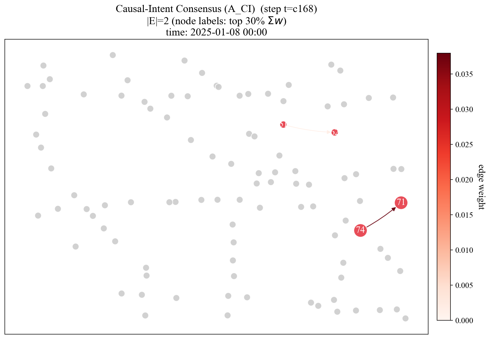

   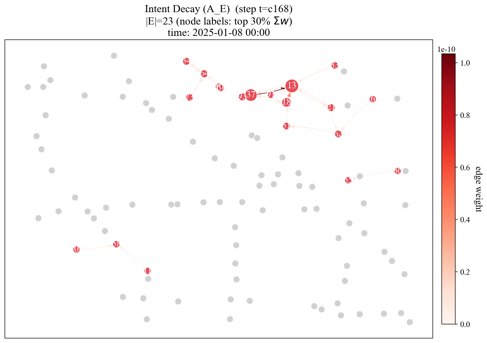

   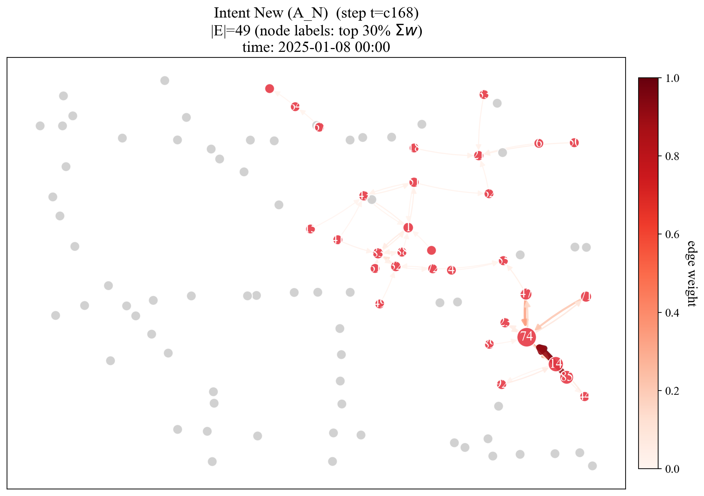

   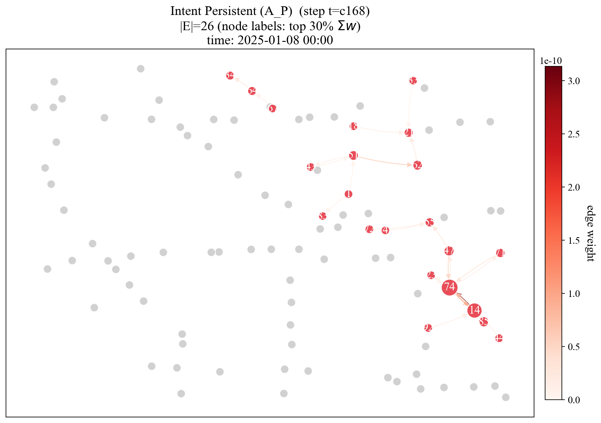

   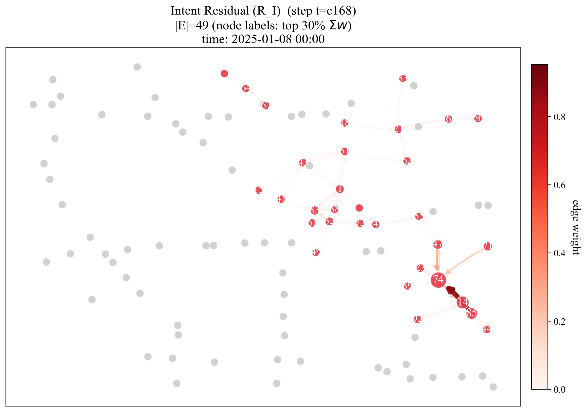

   

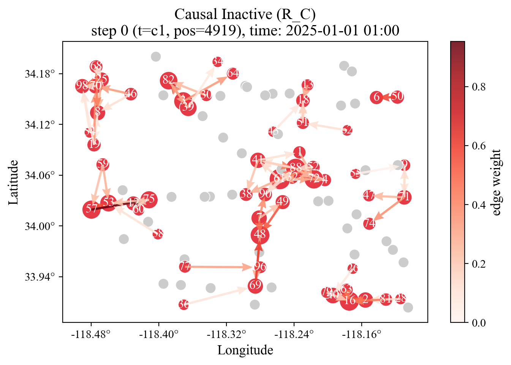

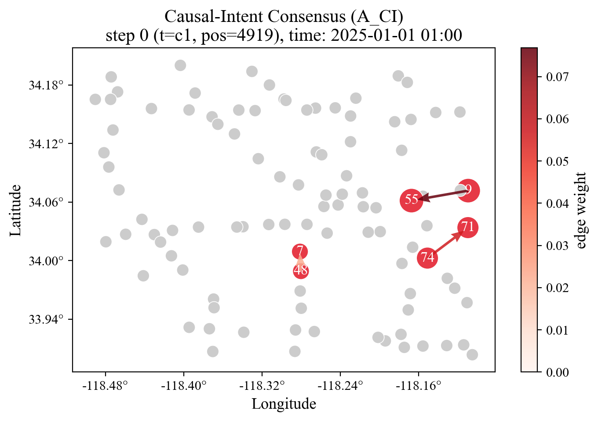

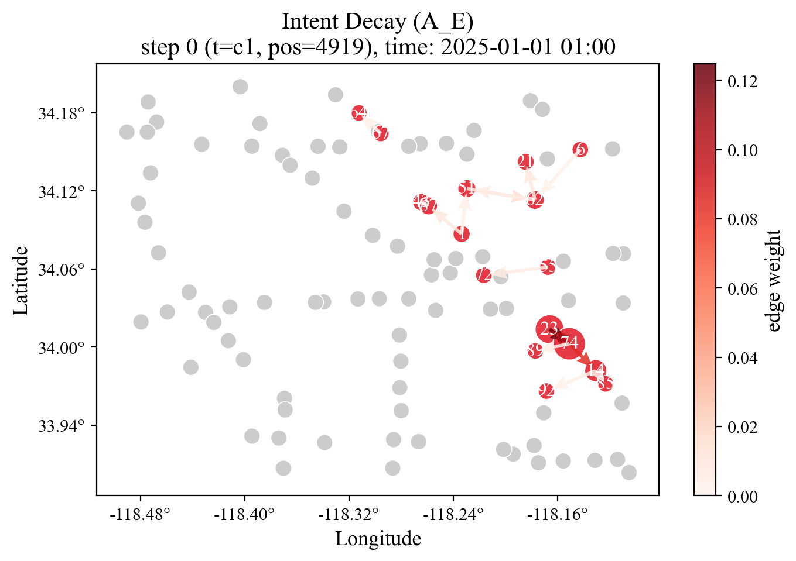

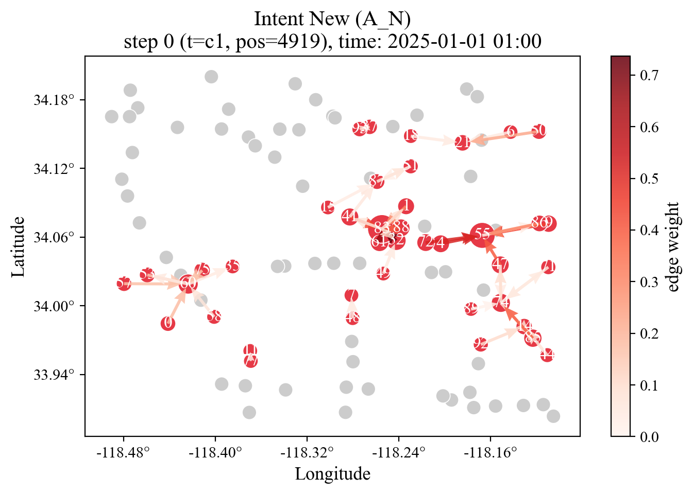

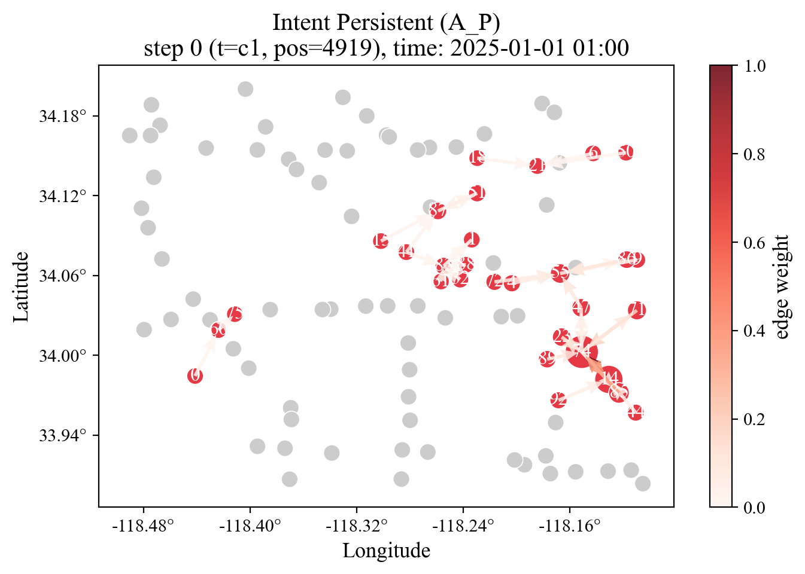

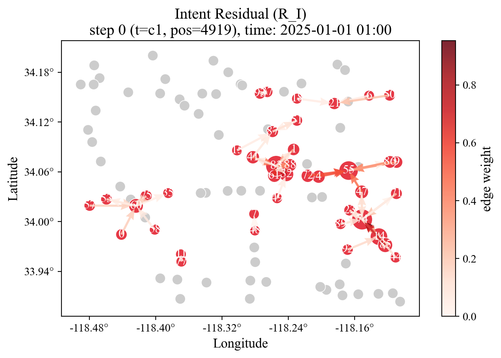

#### run_20260709_172432

把主循环从"先节点后边"翻转为"边驱动、节点跟随"：

1. 取所有 $S_D^t[i,j]>0$ 的候选边，按分数降序排（可用 $Score_i+Score_j$ 做同分次序的 tie-break）。
2. 逐条尝试加入。加入边 ((i,j)) 的**增量成本**为
   $
   \Delta = c_{\text{edge}} + c_{\text{node}}\cdot\big|{k\in{i,j}: k\notin V_{\text{dep}}}\big|
   $
   即边成本，加上"这条边引入的、之前还没部署的端点"的节点成本。已经因别的边而部署过的端点不再重复计费——这自然实现了 (q_{ij}\le p_i,p_j)。
3. 若 $ \text{cost}+\Delta\le B$就接受这条边，并把新端点登记为已部署节点。
4. 最终节点集 $V_{\text{dep}}=\bigcup_{(i,j)\in E_{\text{dep}}}{i,j}$——**节点完全是被边带进来的**。

问题： 

1. ==成本计算的细节原理==

2. ==融合的细节==